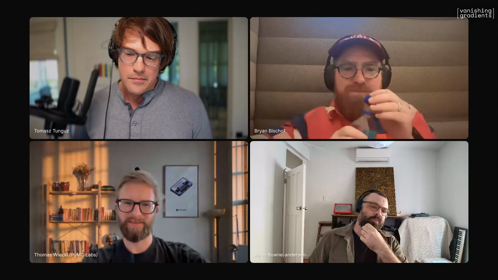
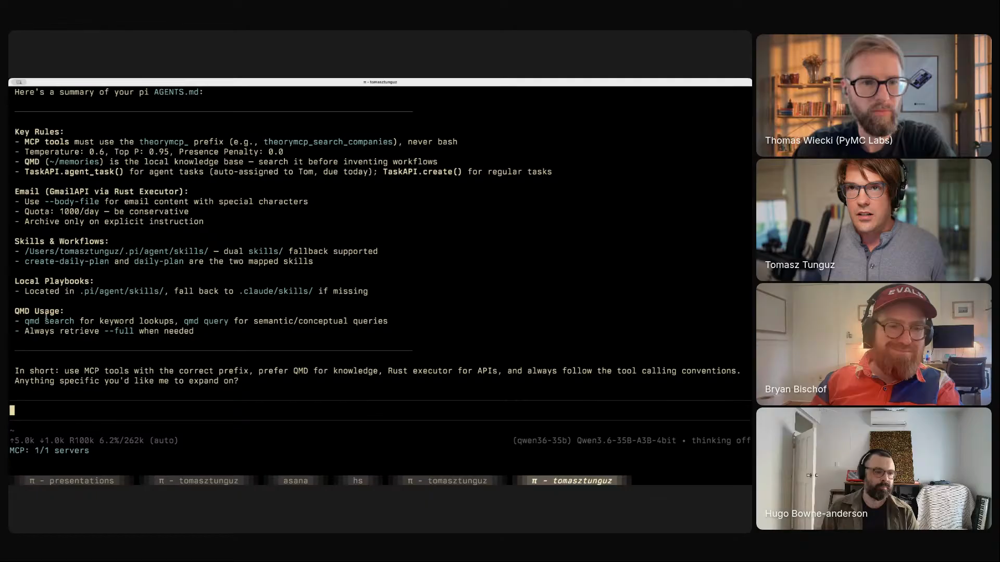
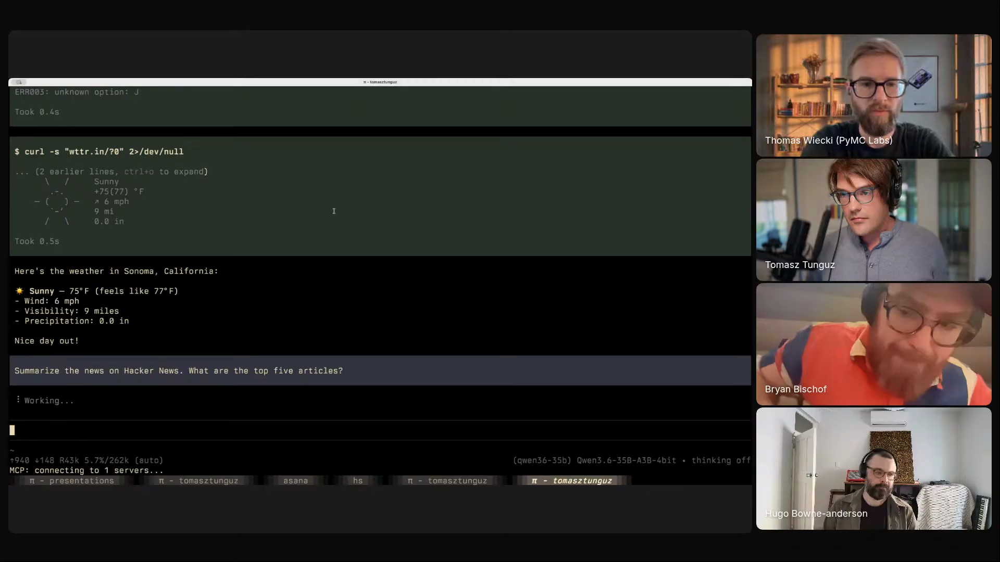
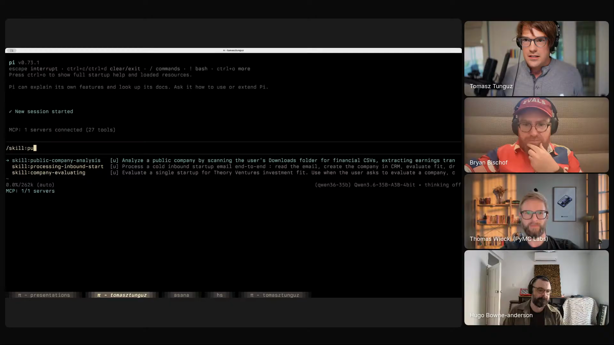
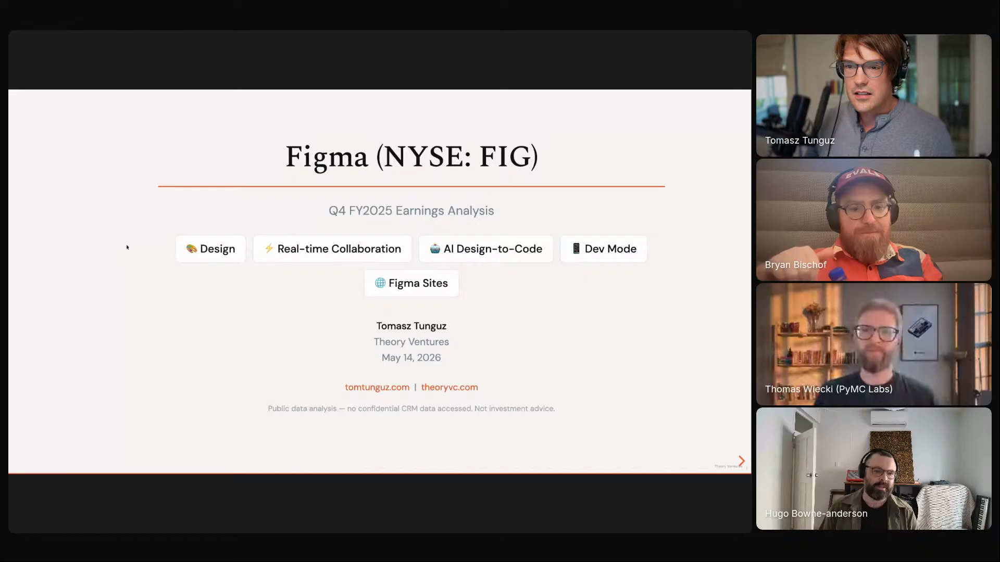
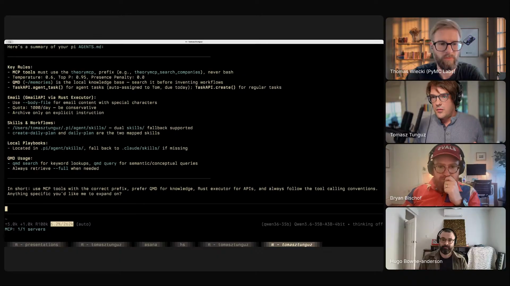

# local-first-agents

An operating model that defaults to a local LLM running on a thin harness, and reaches for cloud inference only for narrowly defined exceptions. Captured from Tom Tunguz's episode 2 segment, where he ran a public-company analysis skill on Figma's earnings inside Pi against a local Qwen 35B-A3B model, generating a full HTML briefing in about two and a half minutes. Thomas Wiecki, mid-segment, flagged what made it distinctive: *"I think you're the first guest to come on that actually uses local models for the majority of the workflow."* [[02:09:47]](https://youtube.com/live/l37PR-OkYKA?t=7787)

Tom opening his segment by naming what he loves about agents: parallelization, and the work of equipping those parallel processes with enough context to actually save time. <a href="https://youtube.com/live/l37PR-OkYKA?t=6576">[01:49:36]</a>

## who showed it

Tomasz Tunguz is a venture capitalist at Theory Ventures who has worked with eight unicorns predominantly in data and data infrastructure, including Looker, Monte Carlo, Dremio, Hex, Omni, and MotherDuck. He writes at tomtunguz.com. Before becoming an investor, he was a product manager at Google managing a billion-dollar AdSense business unit.

## the premise

Tom defaults to local. The majority of his coding and analysis work runs on a Mac M5 against Qwen 35B-A3B inside Pi, with the cloud reserved for narrow exceptions: large multi-file rearchitectures, bugs the local model can't crack, and one creative-writing model. What local-first earns him: it's faster than Claude on the same machine, five parallel calls cost nothing extra, secrets stay on the laptop, tool-calling is reliable, and the laptop keeps working on a plane.

## principles

### 1. Local by default; reach for cloud only when you can name the reason

The default is local. The cloud is for explicitly enumerated cases: large-scale refactors, multi-file rearchitectures, and bugs the local model cannot crack. Plus one creative-writing exception.

> *"the only reason I go to cloud models are large-scale coding challenges, particularly multi-files or rearchitectures or bugs that simply can't be solved. Um, or like, uh, you know what's really interesting? Is Kimi K2.6 is the best creative writer by like a country mile. Uh, and so some of them have particular nuances that are different, and so I'll hit a cloud model for that."* [[02:09:17]](https://youtube.com/live/l37PR-OkYKA?t=7757)

The rule is not anti-cloud. It is anti-default. Switching to the cloud is a decision a reader could have to defend, not a habit.

### 2. Strip the harness to the bone

A thin harness is what makes local inference feel interactive. System-prompt bloat eats the context window before the user has typed anything, and tokens-per-second collapses with it. Pi's system prompt is around 2,000-3,000 tokens. Other harnesses come out at ten to twenty times that.

> *"certain harnesses right out of the gate, you'll have 25 or 40,000 tokens as part of the system prompt, and there you really have a hard time getting the tokens per second to a place where it feels interactive. Uh, and so that's one of the reasons I like Pi. You can literally strip almost to the bone and it'll still work."* [[02:12:07]](https://youtube.com/live/l37PR-OkYKA?t=7927)

Tom asking Pi to summarise its own agents.md. <em>"That's it, right? So it knows about some skills. It knows about a couple of workflows. There's one thing about using the Gmail API. We have Bryan and his team have built an MCP for us, and then there's a QMD lookup."</em> Thin by design. <a href="https://youtube.com/live/l37PR-OkYKA?t=7900">[02:11:40]</a>

### 3. Mac M5 plus Qwen plus Ollama-in-Go is the number that earns local

Local is fast not on principle but because the numbers got there. Tom names them.

> *"like the 35 billion parameter model, you can get, I'm on a Mac M5, I can get 120 to 140 tokens per second with a 256K context window... It's faster than Claude."* [[02:07:42]](https://youtube.com/live/l37PR-OkYKA?t=7662)

A throwaway demo of the speed claim: Tom asks the local Pi to tell him the weather, and the output renders almost instantly. <em>"It's really fast, right?"</em> <a href="https://youtube.com/live/l37PR-OkYKA?t=7715">[02:08:35]</a>

A meaningful part of that speed came from inference engines moving off Python.

> *"a lot of the reasons that local models are slow is because the middleware is primarily built in Python, but now, you know, Ollama's primarily written in Go, so you've seen a 40 to a 50% speed up."* [[02:10:10]](https://youtube.com/live/l37PR-OkYKA?t=7810)

If the local stack is slower than the cloud on your hardware, the rest of the principles do not hold yet.

### 4. Parallel local inference is the actual superpower

A cloud account makes one parallel call expensive. A local stack makes five parallel calls free. The same parallelization Tom names as the power of agents is what local makes operationally cheap.

> *"I think this is where it's going. Uh, it's just like, I mean, you can run five of them at once because now the inference servers are really quite strong."* [[02:09:55]](https://youtube.com/live/l37PR-OkYKA?t=7795)

### 5. Sensitive data and offline use cases fall out for free

Local-first removes two whole categories of friction that come from cloud-by-default: anything you would not paste into a third-party API, and anywhere without internet.

> *"if you're dealing with secrets, you have no fear of pasting in a secret because it's not going anywhere."* [[02:08:58]](https://youtube.com/live/l37PR-OkYKA?t=7738)

Worked example from Tom's morning: he was about to board a flight to Atlanta, the airline said there was no internet, *"and so, like, I... yeah, so download the local model as quickly as possible."* [[02:08:43]](https://youtube.com/live/l37PR-OkYKA?t=7723) The local stack is the same stack whether the laptop is online or not.

### 6. Cap NPM packages at 14 days to defang supply-chain attacks

Agents install dependencies. Local agents installing dependencies still install dependencies. Tom gives a portable heuristic.

> *"a really, a reasonable proxy for secure NPM packages is don't install anything that's newer than 14 days."* [[02:05:08]](https://youtube.com/live/l37PR-OkYKA?t=7508)

The rule is independent of local-vs-cloud, but it matters more here because the agent is doing more work without supervision per call.

### 7. Compose small local models for latency-critical utilities

Cloud APIs make a 3-second utility feel acceptable. A composed local stack can put it at 300ms. Tom's example is a Super Whisper alternative he built by stacking three local models.

> *"I've coded a Super Whisper alternative that uses Parakeet locally running on SwiftLLM, and then it uses an actually a Gemma 4 e4B. And you can, if you put that all into SwiftLLM, you can reduce your latency from 3,000 milliseconds to 300 milliseconds running locally, so 90% reduction, um, for both ASR and then post-processing with a prompt."* [[02:06:10]](https://youtube.com/live/l37PR-OkYKA?t=7570)

The principle generalises beyond ASR. Dictation, classification, parsing, anything in the hot path of a user-visible loop is a candidate for a composed-local stack rather than a single cloud call.

### 8. Resuming a session is a grep away

Pi writes every session to disk passively. Picking up yesterday's thread is a ripgrep over that directory.

> *"The other thing that I love about Pi is it passively saves your sessions. And so then you can ask this model, and as I did earlier today, uh, I was working on this particular thing, can you run ripgrep over the Pi sessions for the last six hours and find where we were, and then pick it up."* [[02:12:58]](https://youtube.com/live/l37PR-OkYKA?t=7978)

This doesn't solve memory at large, which Tom names earlier in the segment as the most frustrating thing about working with agents:

> *"the most frustrating thing, which is now being solved by skills and... but it's memory. It's really effective memory systems, because they demonstrate such a level of intelligence, and then they they forget."* [[01:52:14]](https://youtube.com/live/l37PR-OkYKA?t=6734)

## what a session looks like

The Figma earnings demo is the worked example. The skill is wired up once, then runs on a launch daemon every weekday morning.

Tom launching the skill inside Pi: <em>"I live in Pi and I run local models. Um, and I love Qwen 35B-A3B."</em> The harness, the model, and the skill all sit on the same laptop. <a href="https://youtube.com/live/l37PR-OkYKA?t=7250">[02:00:50]</a>

1. **Pick the skill, name the target.** Tom runs `public company analysis for Figma` inside Pi. Figma announced earnings that day; the skill knows what to do with that.
2. **Skill pulls structured data.** CSVs of the company's financials come down from a data source into a folder.
3. **Skill pulls narrative data.** Earnings transcript fetched via Exa for the same ticker.
4. **Skill generates charts.** R libraries against pre-existing style sheets Tom has accumulated.
5. **Skill assembles HTML output.** Present.js is the library Tom converged on. *"this is Present.js, and this is the best library I found for customization of software."* [[02:05:41]](https://youtube.com/live/l37PR-OkYKA?t=7541)
6. **Read the briefing.** Roughly two and a half minutes from kickoff, on a local model.

The skill's output is an HTML deck. The title slide here shows Figma's ticker, the Q4 FY2025 framing, and product-area tags (Design, Real-time Collaboration, AI Design-to-Code, Dev Mode, Figma Sites); subsequent slides walk through revenue, net dollar retention, liquidity, and pull-quotes from the quarterly report. Hugo: <em>"wonderfully modern of you to be generating HTML, Tom... we've kind of rediscovered HTML as a great way for agents to present information to us."</em> <a href="https://youtube.com/live/l37PR-OkYKA?t=7340">[02:02:20]</a>

7. **Schedule it.** Run the skill as a launch daemon. *"every morning it checks, okay, which publicly traded companies have announced earnings."* [[02:03:33]](https://youtube.com/live/l37PR-OkYKA?t=7413)

## anti-patterns

- **A 25-40K-token system prompt out of the box.** It eats the context window and tanks tokens-per-second; the experience stops feeling interactive even on hardware that could run the model fast. The fix is harness choice, not bigger hardware.
- **Cloud-by-default on every call.** A cloud round-trip is acceptable when you cannot name a reason for it; it becomes the bottleneck once the local stack is in place. The rule is to default local and name the exception.
- **Treating "the smartest cloud model" as the right tool for every task.** Most tasks Tom runs do not need it. A 35B local model handles tool calling, single-file coding, and structured workflows well enough that reaching for a frontier model is wasted latency.
- **Treating the harness as something you take from a vendor.** Even on Pi, *"the simplest version of a harness, you just find yourself, or I find myself just adding more and more around"* [[01:55:21]](https://youtube.com/live/l37PR-OkYKA?t=6921). The harness is something you reshape, not something you receive.
- **Letting agents install bleeding-edge NPM packages.** Without a recency floor on dependencies, an agent's installer is a supply-chain surface. The 14-day cap is a cheap heuristic, not the full answer.
- **Composing a "small local model" stack out of models you have not tested for tool calling.** Tom tried Gemma 4 and found tool-calling parsers broken across MLX and llama.cpp at the time. Local-first depends on local tool calling working; verify before committing the stack.

## what you need

The workflow is harness/model-agnostic in principle. Tom's current setup, which is the one demoed on the show:

- **A laptop fast enough to make local pay off.** Tom is on a Mac M5; numbers cited above are specific to that machine. The principle is "your local stack must beat cloud on tokens-per-second for the work you actually do," not "buy this exact laptop."
- **Pi as the harness.** Minimal terminal interface, ~2-3K-token system prompt, four tools (read, write, edit, bash), passive session log on disk, in-session tool-writing-and-hot-reload. Hugo on the four-tool philosophy: *"it's got four tools, read, write, edit, bash, and... the whole philosophy is if it needs something, it celebrates the idea of creating it in code itself."* [[02:13:23]](https://youtube.com/live/l37PR-OkYKA?t=8003)
- **Ollama as the inference server.** Written in Go, ~40-50% faster than the older Python-based middleware.
- **Qwen 35B-A3B as the default model.** Handles tool calling, can do "pretty sophisticated coding within a particular file," and runs fast at 4-bit or 8-bit quantization on consumer Apple Silicon.
- **A thin agents.md.** A few skills, a few workflows, an MCP or two, and a pointer to a CLAUDE.md. Resist filling it.
- **A named cloud model for the named exceptions.** Tom uses Claude Code for large multi-file rearchitectures and Kimi K2.6 for creative writing. The list of cloud models should be short and the cases they handle should be enumerable.
- **A skill or two that pulls remote data into the local loop.** Tom's public-company analysis skill uses Exa for transcript retrieval; the rest of the pipeline (R, Present.js, HTML output) runs locally.

## watch it

Pi showing 6.2% context-window utilisation during an active session (262K window, Qwen3.6-35B-A3B-4bit). The whole point of stripping the harness is that the operator gets to spend the context window on the work, not on the system prompt. <a href="https://youtube.com/live/l37PR-OkYKA?t=7927">[02:12:07]</a>

- [**01:49:36**](https://youtube.com/live/l37PR-OkYKA?t=6576): Parallelization as the superpower of agents.
- [**01:52:20**](https://youtube.com/live/l37PR-OkYKA?t=6740): The unsolved memory problem.
- [**02:00:37**](https://youtube.com/live/l37PR-OkYKA?t=7237): "I live in Pi and I run local models," and the Figma skill launches.
- [**02:02:02**](https://youtube.com/live/l37PR-OkYKA?t=7322): The HTML earnings briefing renders.
- [**02:05:08**](https://youtube.com/live/l37PR-OkYKA?t=7508): The 14-day NPM heuristic.
- [**02:06:25**](https://youtube.com/live/l37PR-OkYKA?t=7585): The Super Whisper alt: 3000ms to 300ms by composing local models.
- [**02:07:42**](https://youtube.com/live/l37PR-OkYKA?t=7662): The Mac M5 numbers: 120-140 tok/s at 256K context.
- [**02:08:43**](https://youtube.com/live/l37PR-OkYKA?t=7723): The plane-to-Atlanta anecdote.
- [**02:09:17**](https://youtube.com/live/l37PR-OkYKA?t=7757): The cloud exceptions, including Kimi K2.6 for creative writing.
- [**02:09:47**](https://youtube.com/live/l37PR-OkYKA?t=7787): Thomas Wiecki names what's distinctive: first guest using local for the majority.
- [**02:10:10**](https://youtube.com/live/l37PR-OkYKA?t=7810): Ollama-in-Go and the 40-50% speed-up.
- [**02:12:07**](https://youtube.com/live/l37PR-OkYKA?t=7927): Strip the harness to the bone.
- [**02:12:58**](https://youtube.com/live/l37PR-OkYKA?t=7978): Pi's passive session log + ripgrep for resuming work.

## see also

- [`workflows/agentic-eda/`](../agentic-eda) for an adjacent worked example of pulling agents into structured data analysis, also from episode 2.
- [`workflows/personal-agent-harness/`](../personal-agent-harness) for another guest's take on owning the harness rather than receiving it.
- [Ollama](https://ollama.com) for the local inference server Tom uses.
- [Qwen models](https://qwenlm.ai) for the model family that Tom defaults to.
- [Exa](https://exa.ai) for the search tool used inside the public-company analysis skill.
