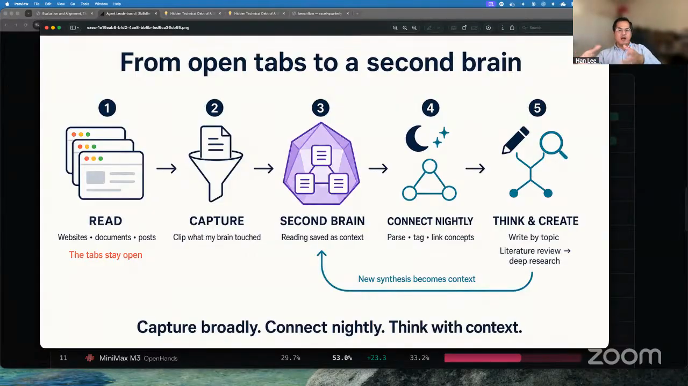
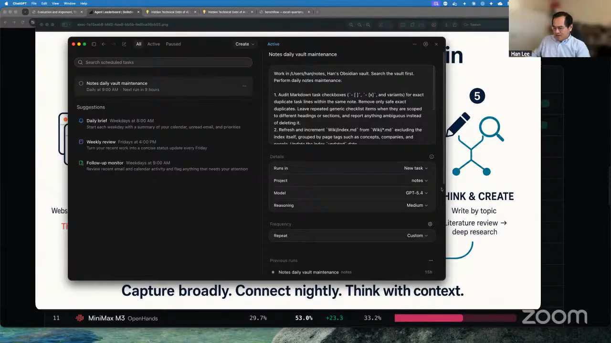
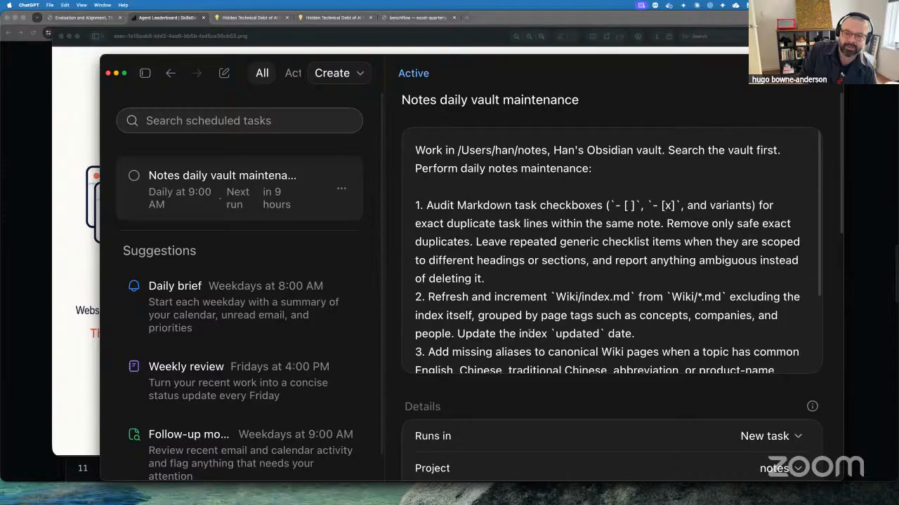
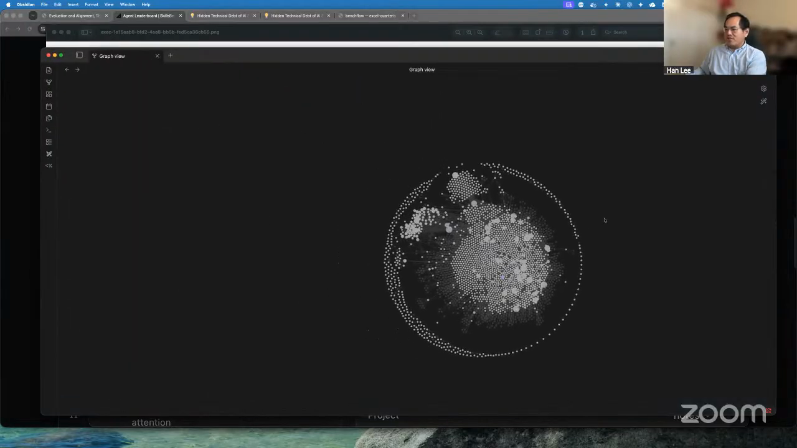
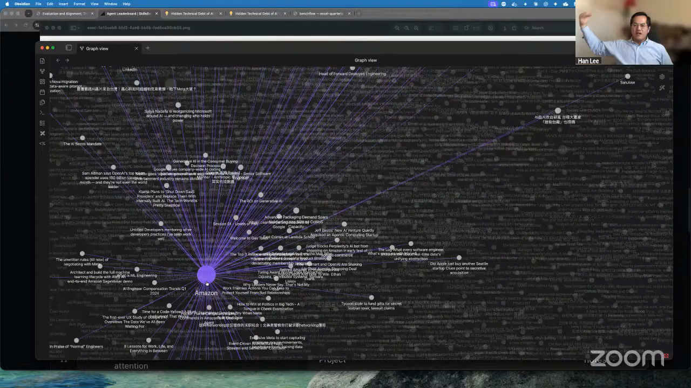
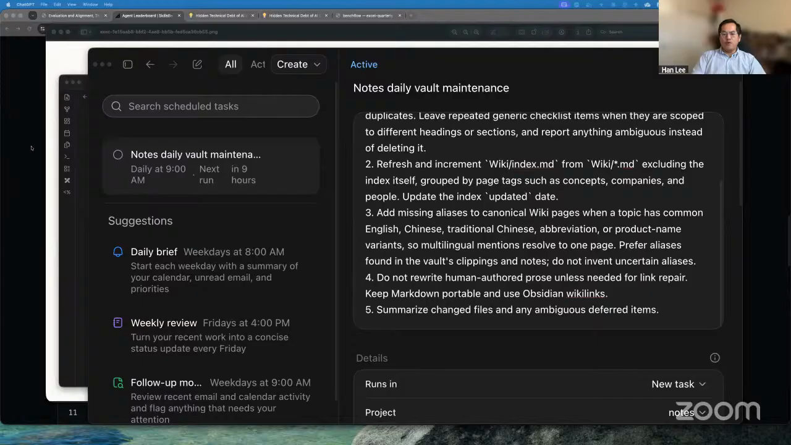

# nightly knowledge graph

Han-Chung Lee's LLM wiki starts with a rule: only material he has read enters the corpus. He clips that material into an Obsidian vault and describes a nightly Codex pass that extracts and links entities and concepts across English, simplified Chinese, and traditional Chinese sources. The recurring task he shows handles the downstream maintenance: refreshing the wiki index, adding evidenced aliases to canonical pages, preserving human-authored prose, and reporting ambiguous items.

Han keeps judgment and comprehension. On a schedule, the agent refreshes the index, maintains aliases and links, preserves Han's prose, and reports ambiguous matches across a corpus he controls. Obsidian keeps the source notes, links, and graph inspectable.

## who showed it

[Han-Chung Lee](https://leehanchung.github.io/) is Director of Machine Learning at Moody's, where he leads teams building custom language models, generative AI applications, and search and discovery systems for financial data. He previously led data science at WalletHub, held engineering roles at Workhuman, AMD, and Ericsson, and spent about a decade running a quantitative fund and managing technology mutual funds.

## the premise

Han often remembers the concept from something he read while losing the exact term or keyword that would retrieve it. Entity pages, aliases, and graph links are designed to provide other routes through his reading archive.

> *"Sometimes I remember I read something somewhere, but I couldn't find it. It's what we in search call tip-of-the-tongue search, where you roughly know the concept, but you don't know the exact term or the keyword to get it out."* [[01:08:29]](https://youtube.com/live/kfCi2EBu-nc?t=4109)

Han's workflow moves material he has read from open tabs into a second brain, connects it nightly, and returns that context to later thinking and writing. <a href="https://youtube.com/live/kfCi2EBu-nc?t=4092">[01:08:12]</a>

## principles

### 1. Read first, clip second

The archive contains material Han has already read. The agent adds tags, aliases, links, and index entries that give him more ways back to the source notes. This keeps the graph connected to his own memory and prevents an unread content feed from becoming a substitute for comprehension.

> *"Only the articles I read, I will clip them, store them in Obsidian. Again, I don't want to clip something I don't remember."* [[01:08:17]](https://youtube.com/live/kfCi2EBu-nc?t=4097)

### 2. Store the source material in a durable vault

Han uses Obsidian as augmented memory. Articles land in the vault before the nightly job runs, giving the agent a stable body of documents it can process repeatedly and giving Han notes and links he can inspect directly.

> *"One of my workflows is I use Obsidian as my augmented memory."* [[01:08:09]](https://youtube.com/live/kfCi2EBu-nc?t=4089)

### 3. Give the archive a nightly maintenance window

Run consolidation as a scheduled batch over the notes folder. Han says he uses Codex and that Claude Code could perform the same job. In the demo he opens the recurring task through a ChatGPT scheduled-tasks interface. The schedule provides a deterministic trigger and a fixed cadence for the semantic work.

Han describes the maintenance cycle as nightly, although the scheduled task shown in the demo is set to run daily at 9:00 AM.

> *"It's a nightly job, sort of. I guess this is my second brain's sleep time when it does the agglomeration and tagging of the subject."* [[01:09:13]](https://youtube.com/live/kfCi2EBu-nc?t=4153)

The recurring task is scoped to the notes folder inside Han's Obsidian vault. <a href="https://youtube.com/live/kfCi2EBu-nc?t=4187">[01:09:47]</a>

### 4. Extract entities and concepts, then write the links back

Han describes the recurring transformation identifying entity names and concept names across all the documents, tagging them, and linking related notes.

> *"On a nightly basis I am using Codex, you can use Claude Code as well, to sift through all of the documents and get all of the entity names and concept names tagged and linked together."* [[01:08:51]](https://youtube.com/live/kfCi2EBu-nc?t=4131)

The maintenance task searches the vault, refreshes `Wiki/index.md` from canonical pages in `Wiki/*.md`, groups the index by page tags such as concepts, companies, and people, and updates the index date. New clippings need an extraction rule that creates or updates those canonical pages, tags, and source links before the index refresh runs.

The task refreshes a tagged wiki index and adds missing aliases to canonical pages inside the vault. <a href="https://youtube.com/live/kfCi2EBu-nc?t=4210">[01:10:10]</a>

### 5. Resolve aliases across languages

Entity linking has to join references that use different names or scripts. Han reads English, simplified Chinese, and traditional Chinese sources, including material from Weibo and Zhihu. With the clipping-to-wiki stage in place, alias resolution can connect a concept such as transformers to relevant notes in every source language.

> *"I want to also get aliases, so if I click on transformers, I can find all of the content that's not only in English but also in Chinese, whatever I clipped from Weibo or Zhihu or something like that."* [[01:11:07]](https://youtube.com/live/kfCi2EBu-nc?t=4267)

Han's task prefers aliases found in the vault's clippings and notes and tells the agent not to invent uncertain aliases. Ambiguous matches stay visible for review.

Han points out that this combination of entity extraction, entity linking, and machine translation would have required a full engineering team three years earlier.

### 6. Use the graph as a browsing surface

The graph view exposes clusters and connections across the vault. Han describes starting from a company such as Uber and shows an expanded Amazon-centered cluster connecting a company page with English and Chinese source material.

> *"You can go in and see how different concepts group together."* [[01:12:03]](https://youtube.com/live/kfCi2EBu-nc?t=4323)

The Obsidian Graph view exposes dense clusters and connections across Han's vault. <a href="https://youtube.com/live/kfCi2EBu-nc?t=4313">[01:11:53]</a>

Test the graph against the problem that motivated it: start with a remembered entity or topic and check whether its links lead back to the relevant source notes.

An expanded company cluster connects the Amazon page to source material with English and Chinese titles. <a href="https://youtube.com/live/kfCi2EBu-nc?t=4365">[01:12:45]</a>

### 7. Keep comprehension with the reader

The agent improves organization and retrieval after Han has done the reading. It does not take over the act of learning. Han warns that outsourcing comprehension can feel efficient now and still create a debt that has to be paid later.

> *"We should be learning the same way, just so that we don't completely outsource our understanding, our comprehension to the models. Because at some point, if we do that, we will have to pay the debt."* [[01:14:45]](https://youtube.com/live/kfCi2EBu-nc?t=4485)

Separately, the scheduled task protects the reader's own writing in its file-editing rules: preserve human-authored prose unless link repair requires a change, keep the Markdown portable, and summarize changed files and ambiguous deferred items.

The task preserves human-authored prose and makes uncertain maintenance work visible instead of silently rewriting it. <a href="https://youtube.com/live/kfCi2EBu-nc?t=4485">[01:14:45]</a>

## what a complete maintenance cycle needs

Han describes entity and concept extraction across the vault. The task shown on screen is a broader vault-maintenance job that also audits duplicate Markdown checkboxes. This workflow uses its wiki and alias steps: refreshing the index, maintaining canonical aliases, preserving human prose, and reporting ambiguity. Steps 2–4, 7–9, and 12 specify implementation rules needed to make the workflow reproducible; their prompts are not shown in the episode.

1. **Read an article.** Finish the material and decide it belongs in the archive before giving it to the agent.
2. **Clip it into the vault with provenance.** Store the article title, source URL, publication date when available, language, and source text in the folder covered by the scheduled task.
3. **Define the page contract.** Choose the canonical wiki directory, required tags, alias field, update date, source-link format, wikilink syntax, and ambiguity log before the first unattended run.
4. **Track new and changed clippings.** Use a processed timestamp, content hash, or state file so the extraction stage can select new work and rerun without creating duplicate pages or links.
5. **Start the scheduled batch.** Launch an agent with access to the vault and the maintenance contract. Han calls this nightly; the task shown is configured daily at 9:00 AM.
6. **Search the vault first.** Inspect existing pages, tags, aliases, and links before creating or changing canonical pages.
7. **Extract candidates from new clippings.** Identify entity and concept names, but do not create a page for every mention. Apply a user-defined promotion rule, such as explicit marking during clipping or recurrence across sources, and send the rest to the ambiguity log.
8. **Resolve identity before creating pages.** Compare each promoted candidate with existing canonical names and aliases across English, simplified Chinese, and traditional Chinese. Defer uncertain matches instead of creating a possible duplicate.
9. **Bootstrap or update canonical pages.** For resolved candidates, create or update the canonical wiki page, attach the required tags, and link the page back to its sources.
10. **Maintain the existing wiki.** Refresh the index from the canonical pages already present in `Wiki/*.md`, grouped by concepts, companies, and people.
11. **Preserve the source notes.** Avoid rewriting human-authored prose unless a link repair requires it, and keep the Markdown portable outside Obsidian.
12. **Report the run.** Summarize changed files, rejected candidates, and ambiguous items that still need a person to decide.
13. **Run a retrieval check.** This is the workflow's proposed validation step. Start with an entity, topic, or cluster you still remember and see whether the graph leads back to the relevant source notes. Record missing links and bad merges for the next maintenance pass.
14. **Repeat on the chosen cadence.** A daily batch keeps ingestion separate from reading and gives new material a regular consolidation window.

## anti-patterns

- **Clipping material you have not read.** The graph fills with context the user never learned, weakening its value as augmented memory and encouraging outsourced comprehension.
- **Relying on exact keyword search.** The workflow exists for moments when the concept remains but the original wording is gone.
- **Treating translated names as different entities.** English, simplified Chinese, and traditional Chinese references need alias resolution or the graph fragments by language.
- **Inventing aliases to force a match.** A false merge distorts the relationships around the canonical page. Prefer aliases already evidenced in the vault and report uncertain cases.
- **Rewriting the source notes during maintenance.** Graph upkeep should preserve the reader's prose and change only the structure needed for tags, links, aliases, and indexes.
- **Skipping the clipping-to-wiki bootstrap.** The visible task maintains pages that already exist. Without an extraction stage for new clippings, the index and graph never absorb the new reading.
- **Running the batch more often than the archive needs.** Han describes a nightly cycle and says he sees no reason to run it sooner.
- **Delegating the reading.** The agent maintains connections among material the user understands. It cannot pay the user's comprehension debt.

## what you need

Han's setup uses Obsidian and a recurring coding-agent task. A reproducible implementation needs:

- **A curated reading archive.** Articles that the user has already read and clipped.
- **A linkable notes vault.** Han uses [Obsidian](https://obsidian.md/) as the durable store and graph interface.
- **A coding agent with filesystem access.** Han says he uses Codex and that Claude Code can perform the same processing. The demo shows the task in a ChatGPT scheduled-tasks interface.
- **A recurring task trigger.** Point it at the vault and choose a batch cadence. Han describes nightly processing; the task shown runs daily at 9:00 AM.
- **Entity and concept instructions.** Tell the agent what to extract, how to tag it, and how to write links back into the vault.
- **Alias rules for every source language.** The instructions need to join language variants and scripts that refer to the same underlying entity or concept.
- **A page contract.** Define the canonical wiki directory, required tags or categories, alias storage, update date, source-link format, wikilink syntax, and the place where ambiguous mappings are recorded.
- **Canonical pages and a tagged index.** Han's visible task resolves aliases to canonical wiki pages and refreshes an index grouped by concepts, companies, and people.
- **A change report.** Record modified files and ambiguous items so uncertain maintenance does not disappear inside an unattended run.
- **A recoverable edit history.** Back up or version the vault, bound the agent's writable scope, and make each unattended run reviewable and reversible. Han does not discuss this safeguard in the episode, but unattended edits to a personal archive need it.
- **Obsidian's graph and backlinks.** These render the links stored in the vault; the scheduled task maintains the underlying Markdown rather than generating a separate graph database.

## watch it

- [**01:07:51**](https://youtube.com/live/kfCi2EBu-nc?t=4071): Han introduces the Obsidian workflow he uses for personal knowledge.
- [**01:08:17**](https://youtube.com/live/kfCi2EBu-nc?t=4097): He clips only articles he has read.
- [**01:08:29**](https://youtube.com/live/kfCi2EBu-nc?t=4109): Tip-of-the-tongue retrieval: remembering the concept after losing the keyword.
- [**01:08:51**](https://youtube.com/live/kfCi2EBu-nc?t=4131): The nightly Codex job extracts, tags, and links entities and concepts.
- [**01:09:13**](https://youtube.com/live/kfCi2EBu-nc?t=4153): The second brain's sleep time.
- [**01:09:43**](https://youtube.com/live/kfCi2EBu-nc?t=4183): Han shows the scheduled task pointed at his Obsidian notes folder.
- [**01:10:37**](https://youtube.com/live/kfCi2EBu-nc?t=4237): The NLP, entity-linking, and machine-translation work this replaces.
- [**01:11:07**](https://youtube.com/live/kfCi2EBu-nc?t=4267): Linking aliases across English and Chinese sources.
- [**01:11:50**](https://youtube.com/live/kfCi2EBu-nc?t=4310): The resulting Obsidian graph.
- [**01:12:28**](https://youtube.com/live/kfCi2EBu-nc?t=4348): An AI-chip cluster connecting companies and manufacturers.
- [**01:14:45**](https://youtube.com/live/kfCi2EBu-nc?t=4485): Keep understanding and comprehension with the human reader.

## see also

- [`workflows/second-brain/`](../second-brain) for Jeremiah Lowin's adjacent workflow built around voice-memo deposits and directly editable agent memory.
- [Obsidian](https://obsidian.md/) for the linkable notes vault and graph interface Han uses.
