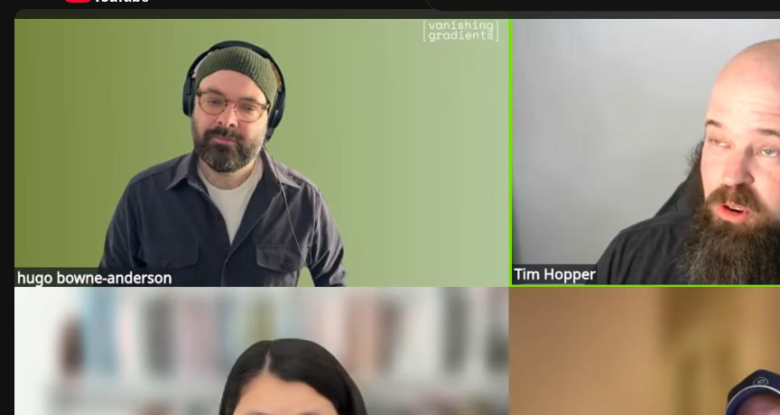
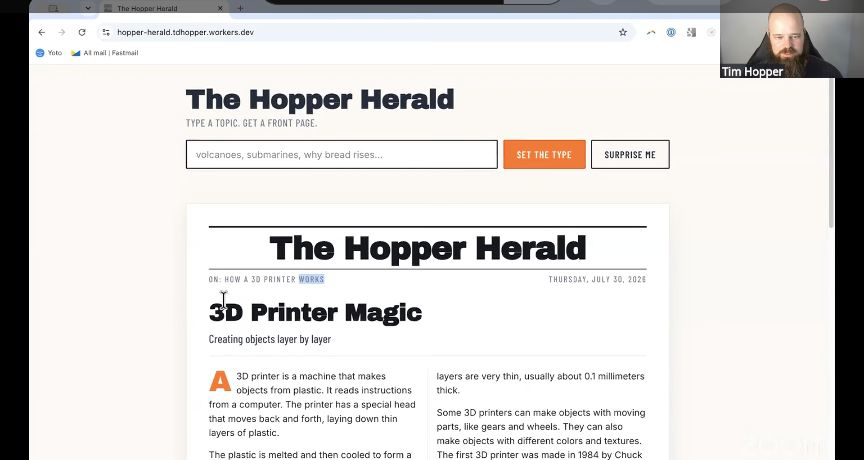
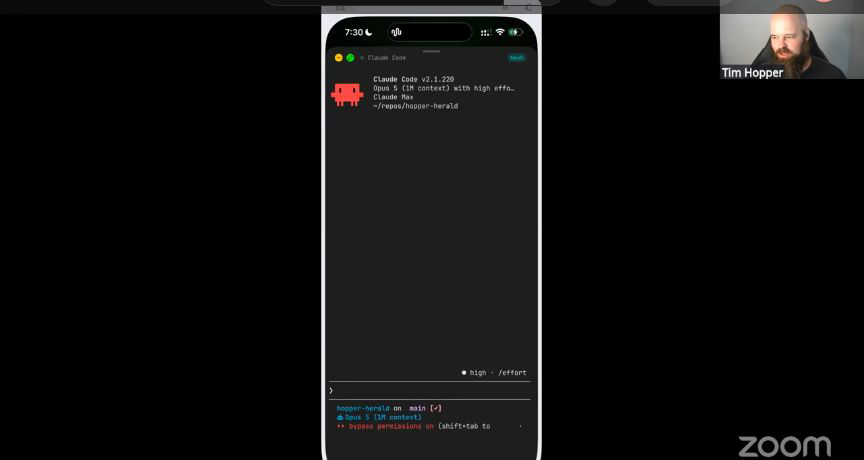

# Persistent phone agent sessions

Tim Hopper runs side projects from an iPhone while Claude Code works on a Mac Mini in his house. Moshi is his mobile terminal, Mosh lets him reconnect after the phone changes networks, Tailscale connects his devices, and Spokenly turns speech into prompts. When he leaves a job running, a Resend skill can email him when it finishes. Before Episode 8, Tim went for a walk and returned with the first version of Hopper Herald, a working magazine site the agent had built and deployed while he was outside.

## who showed it

[Tim Hopper](https://tdhopper.com/) is a machine learning platform engineer and Python developer who has spent more than a decade working on machine learning infrastructure, developer tooling, and production systems. He writes about AI-assisted development, Python tooling, and the infrastructure around research and data science.

## the premise

Tim has four young children. Long, uninterrupted stretches for personal coding became scarce, and agents let him reopen projects that had stalled.

> *"The agent kind of gives sustained focus to something and allows me to have much more intermittent focus."* [\[00:11:50\]](https://youtube.com/live/NH-ic7-V-jY?t=710)

Claude Code keeps working on the project while Tim contributes direction when a few minutes appear. Mosh lets his phone reconnect to the remote shell, and Tim normally uses Zellij to keep project folders easy to reopen. He can prompt the agent at a child's soccer practice, during a walk, or before bed, then put the phone away.

> *"If I have a few minutes of downtime somewhere, I'm pulling out my phone and pulling up Claude Code like this."* [\[00:28:21\]](https://youtube.com/live/NH-ic7-V-jY?t=1701)

Tim explains how sustained agent attention fits around his intermittent availability. <a href="https://youtube.com/live/NH-ic7-V-jY?t=710">[00:11:50]</a>

## principles

### 1. Design for intermittent human attention

Tim does not wait for a free afternoon. At his children's soccer practice, he can spend a few minutes giving an agent a task, put the phone away, and return when another opening appears.

> *"Now I can ... sit at my kid's soccer practice and throw out some prompts."* [\[00:16:32\]](https://youtube.com/live/NH-ic7-V-jY?t=992)

The Hopper Herald site. Tim started it from his phone during a walk before the episode. <a href="https://youtube.com/live/NH-ic7-V-jY?t=1202">[00:20:02]</a>

### 2. Run the session on an always-available computer

The phone is Tim's control surface. Claude Code and the project files live on Pantherbane, his home Mac Mini, which his other devices reach through Tailscale.

> *"I have a Mac Mini at home called Pantherbane, and then I also have Tailscale running so that I can SSH or Mosh into that Pantherbane from anywhere."* [\[00:26:58\]](https://youtube.com/live/NH-ic7-V-jY?t=1618)

### 3. Use a remote shell built to reconnect

Moshi integrates with Mosh, which leaves a server running on the Mac Mini. When the iPhone moves between Wi-Fi, mobile data, and dead spots, Tim can reconnect to that remote shell instead of treating every network change as a new login.

> *"Mosh runs like a persistent server on the target device that then is able to continue that for you."* [\[00:26:42\]](https://youtube.com/live/NH-ic7-V-jY?t=1602)

### 4. Make projects easy to re-enter

Tim keeps Zellij sessions open for several projects and names each one after its project folder. Moshi lists them so he can jump back into the right folder.

> *"When I come back into Moshi, I can just jump straight back into that folder, so I keep them open for a lot of my projects."* [\[00:27:59\]](https://youtube.com/live/NH-ic7-V-jY?t=1679)

### 5. Dictate detailed prompts

Typing on a phone encourages short prompts. Tim dictates with Spokenly when his surroundings allow it. He pauses, restarts, and speaks nonlinearly; the transcription system waits and the agent recovers the instruction.

> *"The agents are so forgiving with mistakes and restarts and pauses and various things, that I'm realizing that they listen to me extremely well."* [\[00:30:13\]](https://youtube.com/live/NH-ic7-V-jY?t=1813)

Claude Code running in Tim's Hopper Herald project on his phone. <a href="https://youtube.com/live/NH-ic7-V-jY?t=1701">[00:28:21]</a>

### 6. Let the result find the human

Moshi can send completion notifications, but Tim also keeps a Resend skill in his dotfiles. Before putting his children to bed or leaving a job overnight, he tells the agent to email a summary and the next steps. The inbox becomes the handoff from sustained agent attention back to Tim.

> *"I wake up the next morning, and I don't have to remember to go check in on the agent. I just have an email telling me what's there."* [\[00:33:02\]](https://youtube.com/live/NH-ic7-V-jY?t=1982)

## what a session looks like

The episode shows the phone connection, Claude Code running on Pantherbane, dictation, and the Resend request.

1. **Keep the project on an available machine.** Tim's Mac Mini holds the codebase and runs Claude Code. His phone supplies instructions.
2. **Reach the machine through Tailscale and Mosh.** Tailscale connects Tim's devices to Pantherbane. Mosh lets the mobile terminal reconnect after a network interruption.
3. **Open the project.** Tim uses Zellij sessions named after project folders, then starts Claude Code with a short alias.
4. **Use the minutes that appear.** Tim checks in from Moshi at soccer practice, on a walk, or before bed.
5. **Dictate the prompt.** Spokenly lets him give the agent a detailed instruction without typing it on the phone.
6. **Leave the agent running.** Claude Code continues on the Mac Mini after Tim puts the phone away.
7. **Request the handoff.** Tim asks the Resend skill to email the result, summary, and next steps. He can later reconnect from his phone or open the same Claude session on Pantherbane from CMUX.

## anti-patterns

These are implementation guardrails derived from Tim's setup, not steps demonstrated separately during the episode.

- **Running the project on the phone.** The phone is a remote control. The filesystem, agent, and durable terminal session belong on a machine that stays available.
- **Relying on a remote shell that cannot reconnect.** Mobile connections change underneath the session. Tim uses Mosh so the phone can reconnect to the server on Pantherbane.
- **Making projects hard to find.** Tim names Zellij sessions after project folders and keeps them visible in Moshi.
- **Reducing the instruction to what is comfortable to type.** Tim uses dictation so a phone keyboard does not set the size of the prompt.
- **Requiring a terminal check to learn that work finished.** Tim asks the agent to email the result and next steps.
- **Giving a remote agent power without checking it.** Tim gives personal agents broad permissions, but he still checks their work and reviews the outputs.

## what you need

The individual tools can change. The workflow needs a durable host, reconnectable remote access, a quick path into each project, a mobile input surface, and a completion channel. Tim's setup:

- **An always-available computer.** Tim uses a home Mac Mini named Pantherbane.
- **[Tailscale](https://tailscale.com/).** Tim reaches Pantherbane from his other devices.
- **[Mosh](https://mosh.org/).** The remote shell survives mobile network changes and dropped connections.
- **[Moshi](https://getmoshi.app/).** Tim's iOS terminal connects through Mosh, lists persistent sessions, and can integrate with agent completion notifications.
- **[Zellij](https://zellij.dev/).** Tim names sessions after project folders so he can return to the right folder.
- **[Claude Code](https://code.claude.com/docs/en/overview).** Tim's primary coding agent runs on Pantherbane.
- **[Spokenly](https://spokenly.app/).** Voice-to-text on iOS gives Tim a faster way to supply detailed prompts.
- **[Resend](https://resend.com/).** Tim's [`resend-email` skill](https://github.com/tdhopper/dotfiles2.0/blob/6e19eb1a4814a2677e1bd9c0404d605d72bea34e/.claude/skills/resend-email/SKILL.md) sends completion summaries and next steps.
- **[CMUX](https://cmux.com/), optionally.** Tim uses it on desktop to reconnect to Pantherbane, continue the same Claude session, and inspect the deployed site alongside the terminal.

Tim's [`zj` function](https://github.com/tdhopper/dotfiles2.0/blob/6e19eb1a4814a2677e1bd9c0404d605d72bea34e/.config/fish/fish-functions.fish#L117) and [`c` alias](https://github.com/tdhopper/dotfiles2.0/blob/6e19eb1a4814a2677e1bd9c0404d605d72bea34e/.config/fish/fish-aliases.fish#L4) show the small shortcuts that make the phone path fast enough to use.

## watch it

- [**00:11:50**](https://youtube.com/live/NH-ic7-V-jY?t=710): The agent holds sustained focus while Tim contributes intermittent focus.
- [**00:16:32**](https://youtube.com/live/NH-ic7-V-jY?t=992): Tim prompts agents from his child's soccer practice.
- [**00:19:45**](https://youtube.com/live/NH-ic7-V-jY?t=1185): Claude Code builds Hopper Herald while Tim walks.
- [**00:26:09**](https://youtube.com/live/NH-ic7-V-jY?t=1569): Tim introduces Moshi and its Mosh integration.
- [**00:26:42**](https://youtube.com/live/NH-ic7-V-jY?t=1602): Mosh keeps a server running on the target machine so the client can reconnect.
- [**00:27:00**](https://youtube.com/live/NH-ic7-V-jY?t=1620): Pantherbane, Tailscale, and the saved connection.
- [**00:27:59**](https://youtube.com/live/NH-ic7-V-jY?t=1679): Tim describes his project-named Zellij sessions.
- [**00:28:21**](https://youtube.com/live/NH-ic7-V-jY?t=1701): Tim opens Claude Code from his phone during a few free minutes.
- [**00:30:13**](https://youtube.com/live/NH-ic7-V-jY?t=1813): Agents tolerate pauses, restarts, and nonlinear dictation.
- [**00:32:55**](https://youtube.com/live/NH-ic7-V-jY?t=1975): Ask Resend to email a summary and next steps when the job finishes.
- [**00:33:52**](https://youtube.com/live/NH-ic7-V-jY?t=2032): Tim prepared for the episode during a walk without touching a keyboard.
- [**00:38:36**](https://youtube.com/live/NH-ic7-V-jY?t=2316): CMUX reconnects to Pantherbane on desktop.
- [**00:38:53**](https://youtube.com/live/NH-ic7-V-jY?t=2333): The same Hopper Herald session continues on a larger screen.

## see also

- [Tim's dotfiles](https://github.com/tdhopper/dotfiles2.0) for the skills, shell functions, aliases, and configuration shown during the episode.
- [How I'm Using Agents](https://tdhopper.com/blog/how-im-using-agents/) for Tim's companion article.
- [`workflows/personal-agent-harness/`](../personal-agent-harness) for Eleanor Berger's always-on personal agent on a separate Mac Mini.
- [`workflows/personal-agent-operations/`](../personal-agent-operations) for Skylar Payne's always-on agent for events, email, memory, and personal operations.
