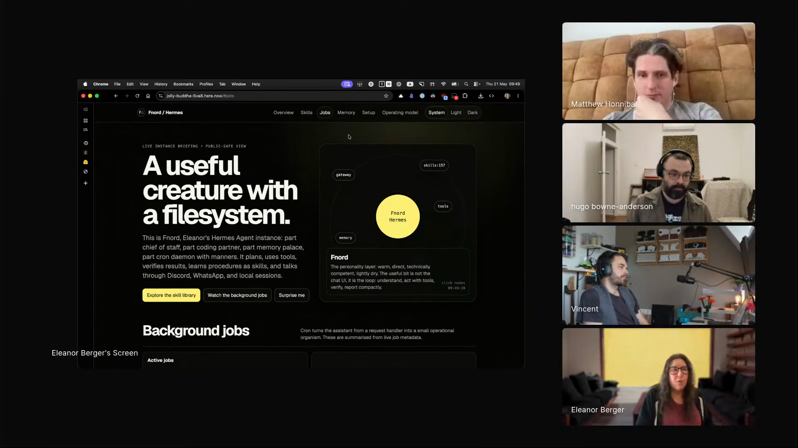
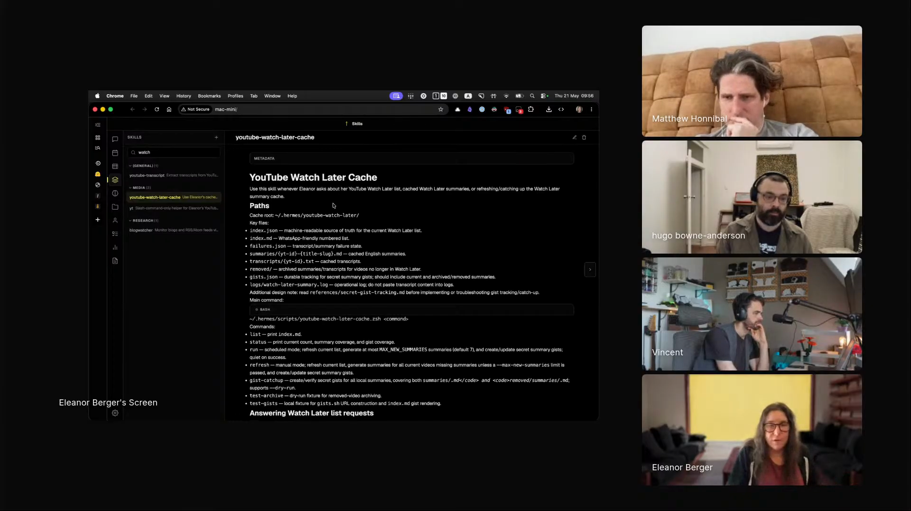
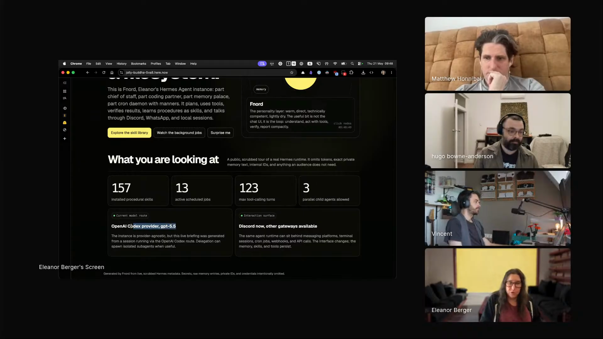

# personal-agent-harness

A personal agent that lives on spare hardware in your house, accessed from any device via Discord or WhatsApp, with autonomy you grant gradually and a skill set the agent extends for itself. Captured from Eleanor Berger's episode 3 segment, where her instance is named Fnord, runs Hermes on a repurposed M1 Mac mini connected over Tailscale, and at the start of her segment she asked the agent on Discord to produce the presentation for the show.

## who showed it

Eleanor Berger is a technical member of staff at Jimini Health, where she works on AI for mental health. She is the creator of agentic ventures, an AI coding and agentic engineering course and community, and was formerly a principal engineering lead at Microsoft and Google.

## the premise

Eleanor is shifting how she works with agents. The previous mode was pedantic: versioned skills, careful management, treat the toolchain like a software package. The new mode is YOLO inside a perimeter:

> *"I've been kind of quite pedantic, treating skills like a software package... And I still think that's important for a lot of my more serious work. But I'm having right now this moment... where I let go. And the thing that changed it for me is Hermes."* [\[00:41:05\]](https://youtube.com/live/ud2WzkKeDZs?t=2465)

The perimeter is the load-bearing piece. The harness lives on spare hardware, segregated from her work environment. It cannot reach her clinical data at Jimini. Inside the perimeter, the agent has 157 skills, scheduled jobs, parallel child agents, multiple input channels, and the standing authority to write its own scripts when an LLM call would be wasteful.

> *"I've been impressed with its ability to monitor itself and make good decisions on where it needs my approval."* [\[00:41:36\]](https://youtube.com/live/ud2WzkKeDZs?t=2496)

The workflow being used live: minutes before joining the stream, Eleanor messaged Fnord on Discord and asked it to produce a presentation about itself. It published a working interactive page to here.now that catalogued its own 157 skills, organized by category, named the input channels (Discord, WhatsApp, CLI, API), and listed its scheduled jobs. She showed it on stream as the first artifact of her segment.

The Fnord presentation page on here.now, produced from a one-line Discord prompt minutes before the stream. <a href="https://youtube.com/live/ud2WzkKeDZs?t=2870">[00:47:50]</a>

## principles

### 1. Earn autonomy gradually

> *"I started with having it ask me for permission for everything. And with time, I kind of gave it a bit more rope."* [\[00:56:12\]](https://youtube.com/live/ud2WzkKeDZs?t=3372)

The agent does not start at YOLO. It starts at "ask for everything." Trust is built one approved action at a time, until the agent's self-evaluation is reliable enough that you delegate the approval decision back to it for routine work. The principle is reversible: anything that crosses the line goes back to approval-required.

### 2. Segregate the agent by hardware, not just by permissions

Eleanor invokes Simon Willison's [lethal trifecta](https://simonwillison.net/2025/Jun/16/the-lethal-trifecta/) (private data, outbound network, untrusted content) and concedes the threat is essentially unmitigable in software:

> *"If you are getting instructions from the internet and you have connections out to the internet, you should assume that you are completely exposed. There's no way around it."* [\[00:56:12\]](https://youtube.com/live/ud2WzkKeDZs?t=3372)

The mitigation is physical. Fnord lives on a separate M1 Mac mini, reachable over Tailscale, isolated from Eleanor's main work environment. It has no path to her clinical data at Jimini. The hardware isolation is what lets the YOLO mode be safe inside the perimeter.

### 3. Under-specify the cron, let the agent route LLM vs script

The harness routes between deterministic scripts and LLM calls per task. Eleanor exploits that by under-specifying:

> *"I create a lot of cron jobs all the time and a lot of them I under-specify. I just say like, can you please do this like whatever every two hours. And it's really good at figuring out when it will need to do something deterministic and when it should engage in LLM, including if it needs to call an LLM from within the deterministic process."* [\[01:00:24\]](https://youtube.com/live/ud2WzkKeDZs?t=3624)

Wasteful per-tick LLM calls for routine work are the failure mode this avoids. Matt Honnibal voiced the same pattern from a different angle in the middle of Eleanor's segment, on his spaCy release-notes setup:

> *"I really like having scripts which are this mix of procedural code and just one step that requires the agent... the task is draft release notes. Just have it invoked to draft release notes and then deterministic logic takes over for the rest."* [\[00:57:53\]](https://youtube.com/live/ud2WzkKeDZs?t=3473)

Two builders, same conclusion: the unit of agentic work is one step inside an otherwise deterministic flow.

### 4. Let the agent author its own skills

Eleanor did not write the YouTube watch-later skill. She asked for it, in a chat message, from public transport. The agent did:

> *"These are all skills that I didn't try to myself, right? I just asked... and it created the skill for me."* [\[00:54:39\]](https://youtube.com/live/ud2WzkKeDZs?t=3279)

The signature is visible. The skill's description starts *"use this whenever Eleanor or us..."*, third-person phrasing Eleanor would never write:

> *"I would never refer to myself in the third person. But it's just I asked very briefly in the chat and it invented this way to do it and it did a pretty good job."* [\[00:54:39\]](https://youtube.com/live/ud2WzkKeDZs?t=3279)

The agent invented the script, the caching of already-processed videos, the live-browser approach (since YouTube has no public API), and the third-person framing. The skill set grows because the agent grows it. A vendored snapshot of this particular skill is at [`skills/youtube-watch-later-gist-summaries/`](../../skills/youtube-watch-later-gist-summaries).

The YouTube Watch Later Cache skill that Fnord wrote for itself from a single chat message. The description, the cache logic, and the third-person phrasing are all the agent's invention. <a href="https://youtube.com/live/ud2WzkKeDZs?t=3295">[00:54:55]</a>

### 5. Verify by observing artifacts, not by AI-auditing AI

The principle that underwrites the whole arrangement:

> *"Verification is not getting an AI to look at the YAML files. The verification is to look at what happens when you run these YAML files... and realize the cloud's footprint and is it exactly what we expect. And anything other than that is not good enough."* [\[00:33:13\]](https://youtube.com/live/ud2WzkKeDZs?t=1993)

AI-reviewing-AI is an infinite regress. The escape is to observe an artifact the agent produced and compare it to your expectation: a published HTML page, a Kubernetes cluster's actual state, a generated summary, an updated Anki collection. The architecture is biased toward delegating tasks where this observation is cheap.

> *"If it were only like, now do another AI review and then do an AI review of the AI review, and that's not something I can trust."* [\[00:33:13\]](https://youtube.com/live/ud2WzkKeDZs?t=1993)

This is also why Eleanor stopped caring what language the agent writes in. Legibility of code is the wrong verification target:

> *"If it's written in like PHP in continuation passing style, but it produces the right results, that's fine with me."* [\[01:01:43\]](https://youtube.com/live/ud2WzkKeDZs?t=3703)

### 6. Make Discord the front door

Eleanor talks to Fnord through several channels (CLI, API, WhatsApp), but Discord is primary. The reasons are concrete: it is mobile, it threads, and it stays responsive across long-running parallel jobs.

> *"I have lots of different ways of talking to this agent. I especially like Discord. Somehow the Discord integration is really good and it's kind of very responsive, and it gives you, can manage stuff in threads. So I do a lot there."* [\[00:45:15\]](https://youtube.com/live/ud2WzkKeDZs?t=2715)

The mobility of the channel is the difference between "the agent does work while I am at my desk" and "the agent does work while I am on public transport." Eleanor's worked example of the latter: she conceived and asked for the watch-later summarization skill in a Discord message while commuting, *"I think like I was on public transport and chatting with my phone because then that's when I have time to for these little games."* [\[00:52:57\]](https://youtube.com/live/ud2WzkKeDZs?t=3177)

## what a session looks like

There is no single session shape. The harness handles three:

**Interactive request.** You voice a one-line ask from any device. The agent decides whether it needs an LLM call, a script, an existing skill, or your approval, then produces an artifact (HTML page, file, summary, message) somewhere observable. You read the artifact, not the code.

**Scheduled cron job.** You under-specify a recurring task ("every two hours, do X"). The agent picks what is scripted vs LLM-routed, runs unattended, and accumulates artifacts you can spot-check.

**Skill creation.** You describe a capability you want, in a chat message. The agent writes the skill (script, description, caching, whatever the task needs), adds it to its own skill set, and uses it on the next invocation.

What ties them together is the rope-lengthening. Every time the agent's self-evaluation correctly catches a case that needed approval, the next similar case can run unattended. The perimeter (segregated hardware, no path to sensitive systems) is what makes the rope-lengthening safe.

## anti-patterns

- **YOLO from day one.** Skipping the permission-for-everything period means you never built the calibration that lets you trust the agent's self-evaluation later. The autonomy is earned, not declared.
- **Letting it near sensitive systems.** Eleanor draws the line at clinical data. The whole "let the agent roam" model only works because it cannot reach the systems where the cost of a misstep is uncapped.
- **AI-reviewing-AI as verification.** A second AI reading the first AI's output produces no new information; it just compounds the original uncertainty. Observe the artifact.
- **Over-specifying the cron.** If you tell the agent which steps are LLM and which are script, you have built a script, not a routing system. The benefit is the agent picking.
- **One channel only.** A desktop-only CLI loses the mobility that makes "ask from anywhere" work. A mobile-only chat loses the local file and process access. The harness handles both because the tasks demand both.
- **Treating the personal harness as your main coding tool.** Eleanor still uses Codex (with GPT 5.5) for serious work and keeps the pedantic skills discipline there. The personal harness is for the rest of life, not the production codebase.

## what you need

The pattern is harness-agnostic in principle, but the components Eleanor uses are load-bearing in practice.

- **Spare always-on hardware with a desktop environment.** Eleanor uses an M1 Mac mini that was lying around. The desktop environment is what lets the agent drive a real browser (for example, against YouTube, which has no public API). A modest GPU helps for local embeddings, and a Mac mini is cheaper than a comparable cloud GPU instance.
- **Tailscale.** Reach the box from anywhere without exposing it to the public internet, and keep it on its own network slice away from your work environment.
- **An agent harness with skill management, scheduled jobs, parallel child agents, and LLM-vs-script routing.** Eleanor runs Hermes. The LLM-vs-script routing in particular is what she calls out as the unlock relative to other harnesses she tried earlier.

The headline stats from Fnord's presentation page: 157 hardwired procedural skills, 13 active scheduled jobs, 123 max tool-calling turns, 3 reports built on demand. This is what a personal harness looks like after the YOLO period has been running for a while. <a href="https://youtube.com/live/ud2WzkKeDZs?t=2820">[00:47:00]</a>
- **A strong base model.** Eleanor's Hermes shift coincided with GPT 5.5: *"with 5.5 they finally overcome this and it's just an amazing model. I'm using it almost exclusively now either in Codex app or in Hermes or in VS Code or whatever."* [\[00:44:09\]](https://youtube.com/live/ud2WzkKeDZs?t=2649)
- **Discord (or another mobile-friendly threaded chat) as the primary interface.** Threading is what makes long-running parallel jobs legible from a phone. Eleanor also uses WhatsApp, CLI, and API access; Discord is the daily-driver.
- **A publishing destination for artifacts.** Eleanor uses [here.now](https://here.now/), a GitHub Gist-like service for HTML, plus an agent skill that publishes there automatically. Generated artifacts live at URLs you can read, share, and refer back to. The skill is at [`skills/here-now/`](../../skills/here-now).
- **A design skill if you are not a designer.** Eleanor uses [Impeccable](https://impeccable.style/) so the agent's HTML output is legible, and evaluates by taste rather than by knowing typography. The skill is at [`skills/impeccable/`](../../skills/impeccable).
- **A cron mechanism.** Hermes ships its own; system cron works too. The point is that recurring jobs land in the same harness as interactive requests, not in a separate runbook.

A few worked examples of skills Eleanor has running on Fnord:

- The agent-authored [`youtube-watch-later-gist-summaries`](../../skills/youtube-watch-later-gist-summaries) (cached, browser-driven).
- The [`anki-connect`](../../skills/anki-connect) skill tied to a cron job for daily flashcard upkeep.
- The [`here-now`](../../skills/here-now) skill and the [`impeccable`](../../skills/impeccable) skill above.

## watch it

- [**00:33:13**](https://youtube.com/live/ud2WzkKeDZs?t=1993): Verification is observing artifacts, not auditing AI. The infinite-regress problem.
- [**00:37:10**](https://youtube.com/live/ud2WzkKeDZs?t=2230): Velocity and the exoskeleton. Why agents work when you know enough to evaluate them.
- [**00:38:34**](https://youtube.com/live/ud2WzkKeDZs?t=2314): The scope problem. Agents nail intent but write a novel when you wanted a one-pager.
- [**00:41:05**](https://youtube.com/live/ud2WzkKeDZs?t=2465): The YOLO shift, and why Hermes finally clicked.
- [**00:42:57**](https://youtube.com/live/ud2WzkKeDZs?t=2577): The Mac mini. Why local hardware beats cloud here.
- [**00:45:15**](https://youtube.com/live/ud2WzkKeDZs?t=2715): Discord as the primary interface, and the live Fnord presentation reveal.
- [**00:49:23**](https://youtube.com/live/ud2WzkKeDZs?t=2963): here.now and the auto-publish habit. Dozens of HTML artifacts a day.
- [**00:50:24**](https://youtube.com/live/ud2WzkKeDZs?t=3024): Impeccable. Design skill for non-designers.
- [**00:52:57**](https://youtube.com/live/ud2WzkKeDZs?t=3177): The watch-later skill the agent wrote for itself.
- [**00:56:12**](https://youtube.com/live/ud2WzkKeDZs?t=3372): The lethal trifecta and the hardware-segregation answer.
- [**00:57:53**](https://youtube.com/live/ud2WzkKeDZs?t=3473): Matt Honnibal's release-notes example. Same hybrid-scripting principle from a second voice.
- [**01:00:24**](https://youtube.com/live/ud2WzkKeDZs?t=3624): Under-specified cron jobs. Agent routes LLM vs script.
- [**01:01:43**](https://youtube.com/live/ud2WzkKeDZs?t=3703): Eleanor's wider stack. Codex, Warp, Zed, language-agnostic.

## see also

- [`skills/here-now/`](../../skills/here-now), [`skills/impeccable/`](../../skills/impeccable), [`skills/anki-connect/`](../../skills/anki-connect), [`skills/youtube-watch-later-gist-summaries/`](../../skills/youtube-watch-later-gist-summaries) for the four ep-3 skills that ship inside this workflow.
- Simon Willison's [lethal trifecta post](https://simonwillison.net/2025/Jun/16/the-lethal-trifecta/) for the security framework Eleanor builds against.
