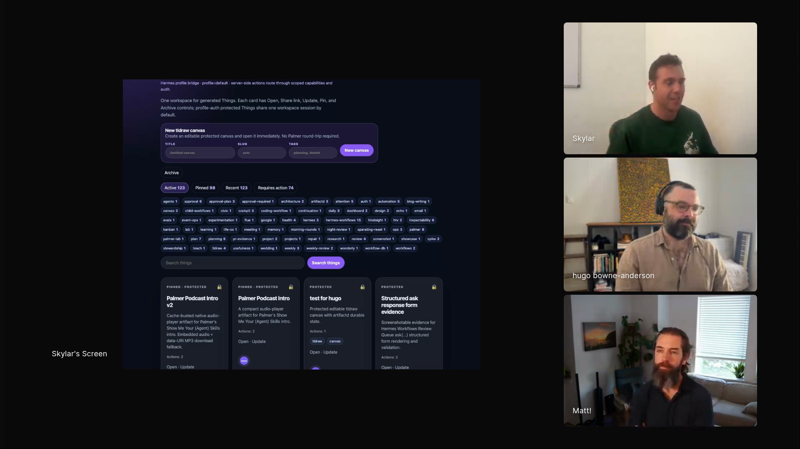
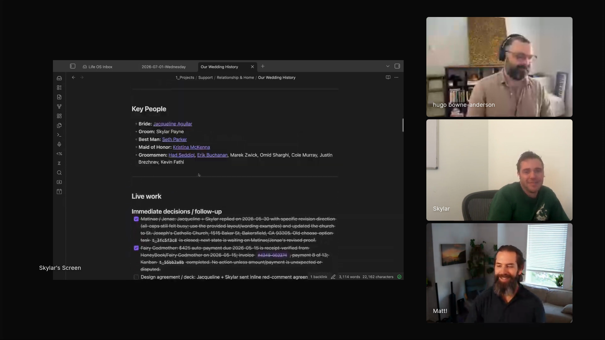

# personal-agent-operations

Skylar Payne uses Palmer, his Hermes agent, as an operations layer for real life: community events, inbox replies, wedding planning, scholarships, generated artifacts, and long-running project memory. Palmer runs enough of the surrounding work that Skylar can maintain a local tech community with weekly events, coordinate personal projects through Obsidian, and hand off small tasks from wherever he happens to be.

## who showed it

Skylar Payne is the founder of Wicked Data. He spent ten years building AI systems at Google, LinkedIn, and startups, and now helps engineering teams build AI systems they can understand and improve. Palmer brings that agent-building work into Skylar's own life, with channels, tools, memory surfaces, artifacts, and review points.

## the premise

Skylar moved back to a hometown without a strong tech community, then gave Palmer enough access to set up events, send notifications, respond to emails, and keep weekly programming moving.

> *"I basically have my personal AI assistant running a tech community."* [\[00:45:36\]](https://youtube.com/live/UwAGIkWFQ78?t=2736)

The community has about 80 people, the hackathon brought in about 40, and the weekly events mostly run without Skylar thinking about them. Palmer is taking on the coordination tax around a living system.

Palmer's artifact workspace gives generated work a durable place to live, with tags, search, and protected cards. <a href="https://youtube.com/live/UwAGIkWFQ78?t=3598">[00:59:58]</a>

Palmer is available when Skylar is away from the computer, and it can be reached through a channel.

> *"It was really important for me to have something that's always on, first of all, and that I could reach through some channel."* [\[00:52:10\]](https://youtube.com/live/UwAGIkWFQ78?t=3130)

## principles

### 1. Give the agent real operational ownership

Palmer owns repeated, interrupt-driven work: event setup, notifications, email replies, hackathon coordination, and recurring community logistics.

> *"We have weekly events now, and it's all mostly just managed. I don't have to think about it."* [\[00:45:36\]](https://youtube.com/live/UwAGIkWFQ78?t=2736)

### 2. Make the assistant reachable away from the desk

Skylar needed an assistant for small one-off tasks while he was away from a workstation.

> *"I might not be at my computer, I don't want to sit down and do it."* [\[00:52:10\]](https://youtube.com/live/UwAGIkWFQ78?t=3130)

Personal operations arrive at odd times. Skylar can ask Palmer from the place where the work appears.

### 3. Give the agent places to put durable artifacts

Skylar built a separate workspace because Palmer needed somewhere to store generated HTML documents. The workspace supports names, tags, search, and shareable artifacts.

> *"I really like to think visually, so I built this little workspace thing where my agent now has a place to put HTML documents."* [\[00:49:21\]](https://youtube.com/live/UwAGIkWFQ78?t=2961)

### 4. Let memory become a project surface

Skylar uses Obsidian as the surface where personal operations become navigable memory. Palmer maintains notes for wedding planning, including emails, vendor contracts, tasks, people, and links back to Gmail.

> *"I have never touched any of these Obsidian notes. It just curated them."* [\[00:59:58\]](https://youtube.com/live/UwAGIkWFQ78?t=3598)

Palmer uses existing context to infer structure, such as wedding roles, people, and vendor threads.

> *"It somehow pulled out like who the best man is and who the maid of honor is without me ever saying anything about that."* [\[00:59:58\]](https://youtube.com/live/UwAGIkWFQ78?t=3598)

Palmer-curated Obsidian notes turn personal operations into a project surface: people, decisions, vendor threads, and linked follow-up work. <a href="https://youtube.com/live/UwAGIkWFQ78?t=3719">[01:01:59]</a>

### 5. Keep memory bounded and inspectable

Skylar is clear that personal-agent memory has a failure mode. It feels weak at first, magical after a week, then harder after a month because retrieval has to select the right small set of memories.

> *"Search and retrieval is still a hard problem."* [\[00:55:25\]](https://youtube.com/live/UwAGIkWFQ78?t=3325)

Hermes keeps a limited memory surface by default, which reduces overload but turns selection into the problem.

> *"If you're gonna have 10 things, which 10 things should you keep?"* [\[00:56:22\]](https://youtube.com/live/UwAGIkWFQ78?t=3382)

### 6. Accept that the harness can change

Skylar uses Hermes because it works for him now. He also says first-party harnesses are catching up: remote access, phone access, email connections, and similar capabilities make the pattern less tied to one tool.

> *"Now with Codex you do have the ability to set up remote access. You can access it through your phone. You can connect it to your email."* [\[00:57:41\]](https://youtube.com/live/UwAGIkWFQ78?t=3461)

The operating model is always-on reachability, tool access, memory, artifacts, and review points. Hermes is Skylar's implementation.

## what a session looks like

1. **Choose an operational domain.** Pick work with recurring tasks and scattered context: a local tech community, a scholarship, wedding planning, inbox triage, vendor coordination, or community events.
2. **Give the agent a reachable channel.** Use a messaging surface, phone-accessible harness, or remote agent so the assistant can take requests when the work appears.
3. **Connect the operational tools.** Give the agent scoped access to email, calendar, artifacts, notes, CRM-style relationship records, and any event or project systems it needs.
4. **Create durable project surfaces.** Generated HTML goes to an artifact workspace. Project memory goes to Obsidian or another inspectable note system. Links back to source emails and records are part of the output.
5. **Let the agent handle recurring logistics.** Event setup, notifications, replies, vendor tracking, and follow-up lists should be boring enough to hand off.
6. **Review the boundaries.** Check the notes, artifacts, and outgoing communications. Tighten access, memory retrieval, or workflow structure when the assistant creates review debt.

## anti-patterns

- **Treating a personal assistant as a chat window.** The value comes from tools, memory, artifacts, and reachability.
- **Keeping generated work trapped in chat.** A useful assistant needs places to store things that can be searched, shared, updated, and linked later.
- **Letting memory grow without inspection.** Personal-agent memory needs a bounded surface, because retrieval gets harder as the memory store grows.
- **Giving the agent vague ownership without review.** Operations can run in the background, but outgoing messages, plans, and sensitive notes still need appropriate checkpoints.
- **Binding the workflow to one harness.** Hermes is Skylar's current setup. The pattern can move as Codex, Claude, or other harnesses gain the same always-on capabilities.

## what you need

Skylar uses Hermes and Palmer, but the pattern is portable.

- **An always-on agent.** Skylar uses Palmer, a Hermes agent running on a Mac Mini.
- **A reachable channel.** The agent should be accessible outside the coding workstation.
- **Scoped tool access.** Email, calendar, artifact storage, notes, relationship records, and project-specific systems.
- **A durable artifact store.** Skylar's `artifactd` workspace stores generated HTML documents with names, tags, and search.
- **A project memory surface.** Skylar uses Obsidian for personal operations and wedding planning.
- **Review habits.** Memory, outgoing communications, and sensitive operational work need boundaries and human inspection.

## watch it

- [**00:45:21**](https://youtube.com/live/UwAGIkWFQ78?t=2721): Skylar says agents let him do more by lowering the barrier to operational work.
- [**00:45:36**](https://youtube.com/live/UwAGIkWFQ78?t=2736): Palmer runs a local tech community with events, notifications, replies, a hackathon, and weekly programming.
- [**00:49:21**](https://youtube.com/live/UwAGIkWFQ78?t=2961): Skylar shows the artifact workspace where Palmer can store HTML documents.
- [**00:50:36**](https://youtube.com/live/UwAGIkWFQ78?t=3036): Palmer chose its own ElevenLabs voice for the episode intro.
- [**00:51:06**](https://youtube.com/live/UwAGIkWFQ78?t=3066): Palmer is a Hermes agent with tools to access a separate deployment.
- [**00:51:24**](https://youtube.com/live/UwAGIkWFQ78?t=3084): Palmer runs on a Mac Mini on Skylar's desk.
- [**00:52:10**](https://youtube.com/live/UwAGIkWFQ78?t=3130): The always-on requirement: reachable through a channel, away from the computer.
- [**00:55:25**](https://youtube.com/live/UwAGIkWFQ78?t=3325): The memory problem: search and retrieval are still hard.
- [**00:57:41**](https://youtube.com/live/UwAGIkWFQ78?t=3461): First-party harnesses are catching up to the personal-agent use case.
- [**00:59:58**](https://youtube.com/live/UwAGIkWFQ78?t=3598): Palmer-curated Obsidian notes for wedding planning.
- [**01:01:59**](https://youtube.com/live/UwAGIkWFQ78?t=3719): Obsidian notes include vendors, planning threads, and Gmail links.

## see also

- [artifactd](https://github.com/skylarbpayne/artifactd), Skylar's open source artifact workspace for generated agent work.
- [Hermes](https://hermes-agent.nousresearch.com/) for the personal-agent harness Skylar uses for Palmer.
- [Obsidian](https://obsidian.md/) for the notes surface Palmer curates in the demo.
