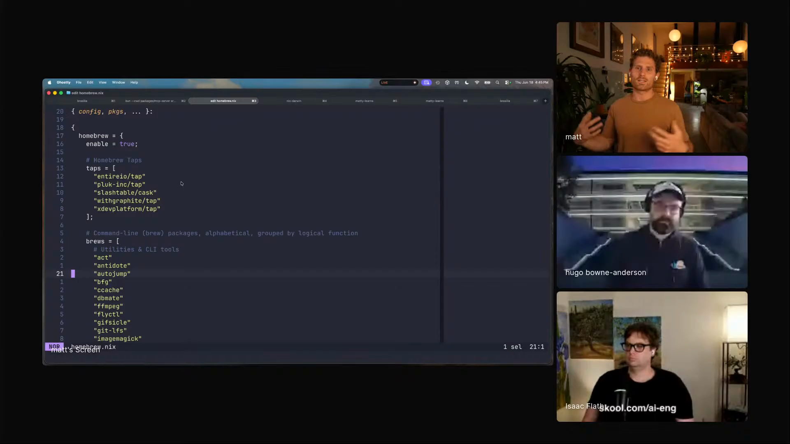
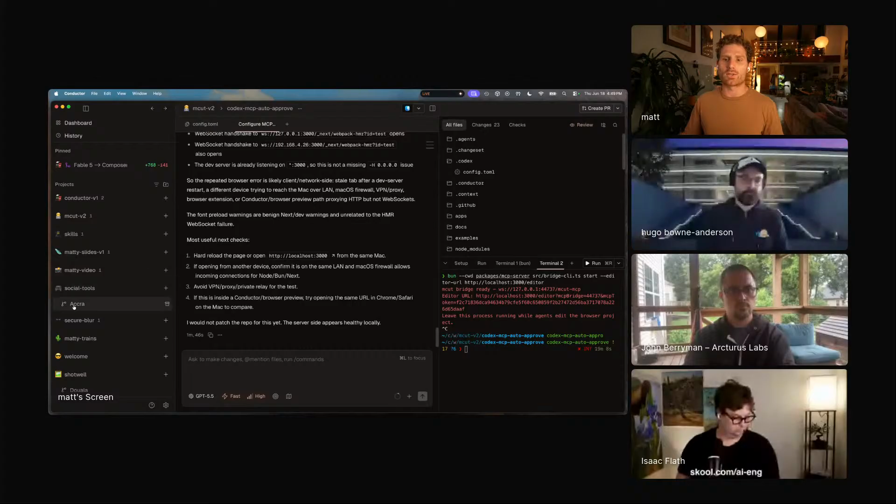

# personal-tools-that-dont-die

A personal-software workflow for keeping side tools alive after the first prototype: define the machine in code, keep daily tools open in agent workspaces, use isolated branches for fixes, and move skills between projects without making them global. Captured from Matt Palmer's Episode 5 segment, where his Nix-managed Mac, Conductor projects, social tools dashboard, and private skills repo form one maintenance loop.

## who showed it

Matt Palmer leads developer experience at Conductor. Before Conductor, he led DevRel at Replit through its shift from online IDE to AI-native product, and he spends a lot of his own time building personal tools for video, content, system setup, and agent workflows.

## the premise

Matt's premise is that personal software becomes practical when the cost of maintenance drops. A tool that only helps one person used to be hard to justify because setup, repair, and polish consumed too much time. Agents change the economics: the builder can keep small tools nearby, fix them when they break, and keep improving them as part of daily work.

> *"I used to be very skeptical of the idea of personal software. I used to be extremely skeptical of like using agents to like edit system configs and and touch sensitive stuff. But like I do all of these things now."* [\[00:40:51\]](https://youtube.com/live/6zju7hyCFl0?t=2451)

The workflow is an operating model: personal code is versioned, easy to run, easy to branch, and easy to improve from the place where the problem appears.

## principles

### 1. Let agents make personal code worth maintaining

Matt's starting point is his own appetite for building. Agents reduce the tedious setup work that used to make personal tools feel too expensive to start and too expensive to maintain.

> *"As someone that loves to build things, now I can just be building things all the time."* [\[00:36:08\]](https://youtube.com/live/6zju7hyCFl0?t=2168)

That changes what counts as worth building. A tool can be small, idiosyncratic, and useful only to you if the agent can help keep it running.

### 2. Put your machine setup in code

Matt manages his Mac with Nix Home Manager and nix-darwin. Packages, Homebrew entries, and system settings live in code, so a laptop rebuild becomes closer to applying infrastructure than remembering a setup checklist.

> *"I manage my entire my my Mac with Nix Home Manager."* [\[00:41:42\]](https://youtube.com/live/6zju7hyCFl0?t=2502)

> *"Home Manager, it's just kind of like Terraform for your laptop."* [\[00:41:50\]](https://youtube.com/live/6zju7hyCFl0?t=2510)

The agent helps with the hard part: writing and navigating dense configuration that Matt says he would not have learned deeply before AI.

> *"with AI, can I use an agent to write this and kind of guide me through the entire setup for my Mac? Yeah, absolutely."* [\[00:43:04\]](https://youtube.com/live/6zju7hyCFl0?t=2584)

Matt shows the dotfiles and Nix Home Manager setup that lets him rebuild his Mac from code. <a href="https://youtube.com/live/6zju7hyCFl0?t=2502">[00:41:42]</a>

### 3. Keep everyday tools open where agents can fix them

Matt keeps personal tools in Conductor projects: his social tools app, video overlays, Chrome extension, mobile app, and related side projects. The important part is proximity. When he sees a bug in a tool he uses, the project is already open in an agent workspace.

> *"I use Conductor kind of as like my agent home base"* [\[00:48:46\]](https://youtube.com/live/6zju7hyCFl0?t=2926)

The loop is direct: notice a problem, switch to the project, send a scoped request through chat, and keep using the tool.

### 4. Use worktrees so fixes do not collide

Conductor creates isolated Git worktrees for workspaces. That gives Matt separate folders and branches for parallel sessions, so personal tools can be repaired without turning the main working copy into a mess.

> *"Every time you click that plus icon, we'll skip the initial prompt, you're gonna create essentially a git work tree."* [\[00:47:06\]](https://youtube.com/live/6zju7hyCFl0?t=2826)

Conductor turns each workspace into an isolated Git worktree so multiple agent sessions can work without stepping on each other. <a href="https://youtube.com/live/6zju7hyCFl0?t=2826">[00:47:06]</a>

### 5. Make improvement easier than abandonment

Matt names the core loop directly: personal projects keep living when fixing them is as easy as sending a chat from the environment where the broken thing is already visible.

> *"that's just like the process of continuous improvement and compounding that means that your projects don't die."* [\[00:49:06\]](https://youtube.com/live/6zju7hyCFl0?t=2946)

> *"if it's as easy as just sending through a chat to fix something that's broken that you use every day and you have it right there, you're gonna do it."* [\[00:49:12\]](https://youtube.com/live/6zju7hyCFl0?t=2952)

This is the difference between a throwaway prototype and a personal tool. The tool survives because repair happens inside the user's normal workflow.

### 6. Install skills per project, and keep the library portable

Matt keeps his skills in a private GitHub repo and installs them into the current project with `skills.sh`. The library is portable, but the context stays scoped to the project.

> *"this is a private GitHub repo, but I can actually install this via skills.sh into any directory."* [\[01:38:50\]](https://youtube.com/live/6zju7hyCFl0?t=5930)

He avoids global skills because too much always-on context makes agents harder to steer.

> *"I intentionally avoid doing project like project specific skills or sorry global skills, because I feel like that kind of pollutes your context"* [\[01:39:12\]](https://youtube.com/live/6zju7hyCFl0?t=5952)

Matt's private skills repo is portable, but skills are installed into specific projects instead of made global. <a href="https://youtube.com/live/6zju7hyCFl0?t=6086">[01:41:26]</a>

### 7. Treat skills like tools that improve through use

Matt's skills addendum is the same workflow in miniature. A skill is valuable when it is used, versioned, and updated after the agent makes a mistake.

> *"the best skills are the ones you use, the best skills are the ones you improve"* [\[01:37:57\]](https://youtube.com/live/6zju7hyCFl0?t=5877)

> *"If they only have one commit, it's not really doing anything."* [\[01:44:37\]](https://youtube.com/live/6zju7hyCFl0?t=6277)

The same habit applies to apps, dotfiles, writing rules, and video tools: keep the useful thing close enough that improvement becomes routine.

## what a session looks like

1. **Keep personal code in repos.** Dotfiles, content tools, overlays, extensions, and skills live in versioned projects, not scattered local state.
2. **Make setup reproducible.** Use configuration-as-code for the machine and scripts that can rebuild or repair the environment.
3. **Keep daily tools open in an agent workspace.** If a tool is used every day, keep it close to the agent surface where fixes happen.
4. **Branch fixes into isolated worktrees.** Start a workspace for the bug, feature, or cleanup so the repair has a branch and a folder of its own.
5. **Send the smallest useful change through chat.** Paste the error, name the broken behavior, or ask for the next improvement.
6. **Merge, keep using the tool, repeat.** The tool compounds because the next fix starts from the improved version.
7. **Install only the skills the project needs.** Pull skills from the private library into the project context instead of keeping every skill global.
8. **Push useful project skills back to the library.** If a project-specific skill is worth reusing, copy it into the personal skill repo and version it.

## anti-patterns

- **Letting personal tools remain one-off demos.** A first version dies when there is no easy path to repair, branch, and improve it.
- **Keeping setup in memory.** If the laptop setup lives in memory or notes, the agent cannot reliably help rebuild it.
- **Opening a new agent session far away from the tool.** The fix should happen where the project, error, branch, and daily context already live.
- **Running all agent edits in one working copy.** Parallel fixes need isolated folders and branches, otherwise small personal tools become risky to touch.
- **Making every skill global.** Global context pollution makes the agent carry instructions that do not belong to the current project.
- **Treating skills as finished artifacts.** Matt's point is that useful skills get commits after mistakes, just like useful software.

## what you need

The workflow is tool-agnostic in principle. Matt's current setup, which is the one demoed on the show:

- **Versioned personal repos.** Dotfiles, tools, and skills need a place where changes can be reviewed, committed, and carried forward.
- **Configuration-as-code for the machine.** Matt uses [Nix Home Manager](https://nix-community.github.io/home-manager/) and [nix-darwin](https://github.com/nix-darwin/nix-darwin) so packages and system settings are defined in code.
- **An agent workspace manager.** Matt uses [Conductor](https://www.conductor.build/) as an agent home base for personal tools and work projects.
- **Git worktrees or equivalent isolation.** The workflow depends on separate folders and branches for parallel sessions.
- **A daily tool worth improving.** Matt's examples include a social tools dashboard, Remotion overlays, a Chrome extension, a mobile app, and dotfiles.
- **A portable skill library.** Matt uses a private GitHub repo plus [skills.sh](https://www.skills.sh/) to install skills into selected projects.
- **A habit of pushing fixes back.** The loop only compounds if fixes, skill updates, and project improvements land in the source of truth.

## watch it

- [**00:36:08**](https://youtube.com/live/6zju7hyCFl0?t=2168): Matt explains why agents let builders stay in motion.
- [**00:40:51**](https://youtube.com/live/6zju7hyCFl0?t=2451): He says personal software and agent-edited system config now feel credible to him.
- [**00:41:42**](https://youtube.com/live/6zju7hyCFl0?t=2502): Nix Home Manager appears as his Mac setup in code.
- [**00:43:04**](https://youtube.com/live/6zju7hyCFl0?t=2584): Agents help him write and navigate the Nix setup.
- [**00:47:06**](https://youtube.com/live/6zju7hyCFl0?t=2826): Conductor workspaces create Git worktrees.
- [**00:48:46**](https://youtube.com/live/6zju7hyCFl0?t=2926): Matt calls Conductor his agent home base.
- [**00:49:06**](https://youtube.com/live/6zju7hyCFl0?t=2946): The core idea: continuous improvement means projects do not die.
- [**01:37:57**](https://youtube.com/live/6zju7hyCFl0?t=5877): Skills are tools that matter when they are used and improved.
- [**01:38:50**](https://youtube.com/live/6zju7hyCFl0?t=5930): Matt installs skills from a private GitHub repo with `skills.sh`.
- [**01:39:12**](https://youtube.com/live/6zju7hyCFl0?t=5952): He avoids global skills to keep context scoped.

## see also

- [`workflows/agent-editable-video-timelines/`](../agent-editable-video-timelines) for Matt's video-editor workflow, where one of these personal tools becomes a browser timeline an agent can operate.
- [`skills/formatting-notion-pages/`](../../skills/formatting-notion-pages) for one of Matt's private skill stubs.
- [`skills/project-planning/`](../../skills/project-planning) for the project-planning stub from Matt's private skills repo.
- [`skills/writing-revision/`](../../skills/writing-revision) for Matt's writing-revision stub.
- [Conductor](https://www.conductor.build/) for the agent workspace product Matt demos.
- [Nix Home Manager](https://nix-community.github.io/home-manager/) and [nix-darwin](https://github.com/nix-darwin/nix-darwin) for Mac setup as code.
- [skills.sh](https://www.skills.sh/) for installing skills into project directories.
