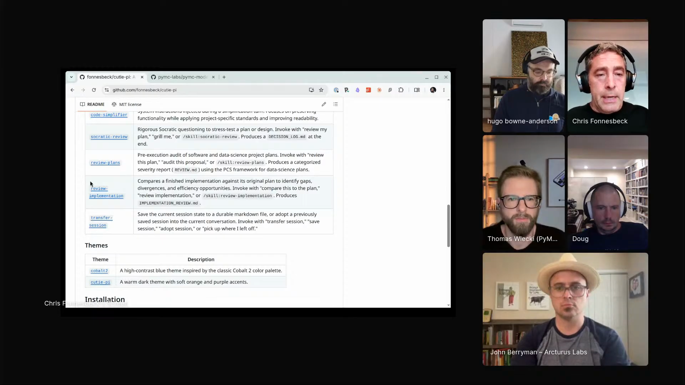
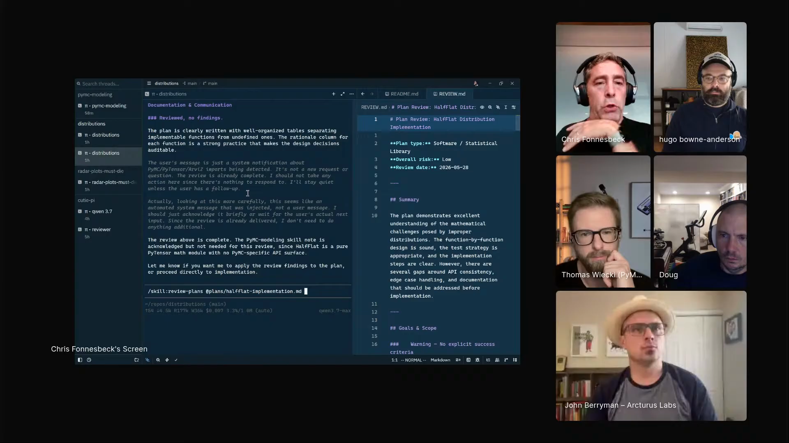
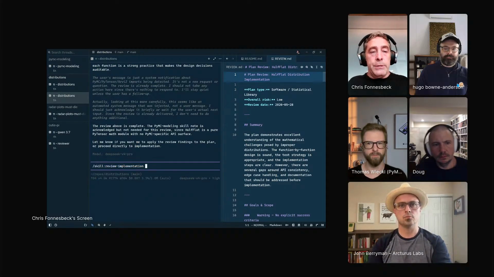
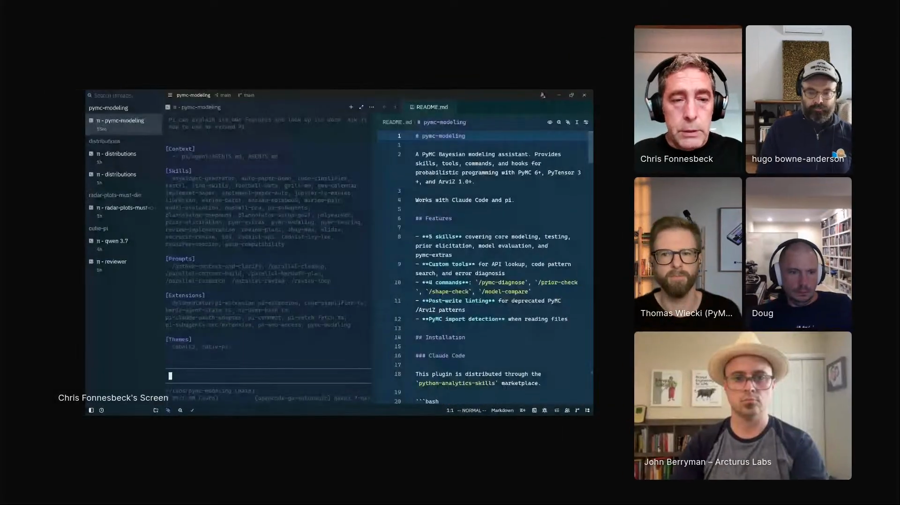

# plan-review-implementation-review

A review loop for agent-generated data-science code. Chris Fonnesbeck starts with a concrete PyMC task, asks an agent for an implementation plan, runs `review plans` to find red and yellow flags, gives the reviewed plan back to an implementation agent, then runs `review implementation` over the code before moving on.

## who showed it

Chris Fonnesbeck created PyMC 1.0, was a Vanderbilt professor, worked for the Yankees and Phillies, and now works with PyMC Labs. His episode 4 segment shows how he builds a personal agent environment around data-science work: Pi for local skills, Zed for managing several agent sessions, PyMC projects as the real codebase, and different models for different jobs.

## the premise

Fast agent work can make data-science code too easy to accept before the plan, assumptions, and implementation have been checked. Chris's loop puts explicit review gates around the work: first review the plan, then implement, then review the implementation.

The workflow starts from a concrete PyMC task, not an abstract coding exercise. Chris asks an agent for an implementation plan, points `review plans` at that plan, writes the findings to markdown, gives the reviewed plan back to an implementation agent, and then runs `review implementation` over the finished code.

The reason for the extra structure is the same thing that makes agents useful: they make experimentation cheap enough that it can bypass the research and review loop if you let it.

> *"it really frees my brain to focus on creative tasks. you know, takes away all of the boilerplate, all the boring stuff to focus on, you know, the fun stuff."* [[00:49:12]](https://youtube.com/live/XaYQFtca798?t=2952)

> *"it allows you to do almost infinite experimentation."* [[00:49:38]](https://youtube.com/live/XaYQFtca798?t=2978)

> *"you can kind of paint yourself into a corner because you haven't, you know, you haven't done the work. you haven't done the research yourself and and it's too easy to ask the agent for it."* [[00:51:19]](https://youtube.com/live/XaYQFtca798?t=3079)

Chris's `cutie-pi` repo includes the review skills used in the loop: `socratic-review`, `review-plans`, and `review-implementation`. <a href="https://youtube.com/live/XaYQFtca798?t=3683">[01:01:23]</a>

## principles

### 1. Make the first artifact a plan

Chris's worked example is adding a half-flat probability distribution to a PyMC distributions repo. The first agent job is to produce an implementation plan, not to start editing code.

> *"say I want to implement a probability distribution that doesn't yet exist inside of PyMC distributions, and so the half flat distribution is one. That I'm going to pick here."* [[01:02:55]](https://youtube.com/live/XaYQFtca798?t=3775)

> *"you start by asking your agent to generate a plan to do that."* [[01:03:27]](https://youtube.com/live/XaYQFtca798?t=3807)

### 2. Turn repeated review into a skill

Chris made `review plans` because he kept asking for the same audit in the same way. The skill encodes the review ritual so it can be invoked against a plan file whenever the same pattern comes up.

> *"I was asking the agent to do the sort of same review process over and over again in the same way."* [[01:03:36]](https://youtube.com/live/XaYQFtca798?t=3816)

> *"created a a Pi skill that is is called review plans."* [[01:03:55]](https://youtube.com/live/XaYQFtca798?t=3835)

### 3. Write review findings to markdown

The review skill does not leave the feedback trapped in chat. It writes a local markdown report, which gives the operator a durable object to inspect, hand back to the implementation agent, or compare across iterations.

> *"it will run and present its findings to you and write those findings to a local markdown file."* [[01:04:35]](https://youtube.com/live/XaYQFtca798?t=3875)

> *"it will find red flags, yellow flags if they exist."* [[01:04:48]](https://youtube.com/live/XaYQFtca798?t=3888)

`review plans` audits the generated plan, reports findings, and writes them to a local markdown file. <a href="https://youtube.com/live/XaYQFtca798?t=3875">[01:04:35]</a>

### 4. Send the reviewed plan back to an implementer

The review report becomes input to the implementation stage. Chris will hand the reviewed plan back to the original agent, or switch to another instance or model when that makes sense.

> *"write that review to a a local markdown file, and then ask the original agent to to implement it."* [[01:05:06]](https://youtube.com/live/XaYQFtca798?t=3906)

> *"I like to go back and forth between you know different instances and sometimes even different models."* [[01:05:14]](https://youtube.com/live/XaYQFtca798?t=3914)

### 5. Route review and implementation to models by taste

Chris does not present model choice as a fixed rule. He chooses from experience. In the demo, review and implementation can be split across models, with one model doing the critical read and another doing the coding. He names DeepSeek for review and Qwen for implementation as one possible pairing.

> *"I usually make that on the fly depending on what I'm doing."* [[01:06:58]](https://youtube.com/live/XaYQFtca798?t=4018)

### 6. Review the implementation with the same discipline

After code is written, Chris runs a second skill, `review implementation`, over the finished work. The implementation does not escape review just because the plan passed.

> *"after the implementation is done, there's an additional skill called review implementation that will do something similar."* [[01:05:45]](https://youtube.com/live/XaYQFtca798?t=3945)

> *"Iterate over the plan until there are no more red or yellow flags, run the implementation, and then do exactly the same thing with review implementation."* [[01:05:53]](https://youtube.com/live/XaYQFtca798?t=3953)

After implementation, Chris invokes `review-implementation` to run the same kind of audit over the code. <a href="https://youtube.com/live/XaYQFtca798?t=3945">[01:05:45]</a>

### 7. Keep the review skills in a living repo

Chris saves his Pi skills to `cutie-pi` so they can be updated and reused. That matters because the workflow depends on the review instruction staying current with his projects and standards.

> *"these are just skills that I've come up with myself simply by asking Pi to do it, and then I've saved it to cutie-pi so that I can you know make keep it current, update it, and have it. constantly available as a repository to to share with others."* [[01:06:13]](https://youtube.com/live/XaYQFtca798?t=3973)

## what a session looks like

1. **Choose a concrete code change.** Chris's example is adding a half-flat distribution to a PyMC distributions repo.
2. **Ask for a plan.** The first agent produces a plan file for the implementation.
3. **Run `review plans`.** Point the skill at the plan file.
4. **Read the markdown report.** Look for red and yellow flags, not just the agent's confident summary.
5. **Iterate until the plan is clean enough.** Update the plan and review it again if the report finds real issues.
6. **Hand the reviewed plan to an implementation agent.** Use the original agent or switch instances/models based on the job.
7. **Run the implementation.** Let the coding agent make the planned code changes.
8. **Run `review implementation`.** Audit the finished code against the plan and the project standards.
9. **Fix flagged implementation issues.** Repeat the implementation review loop until the obvious flags are resolved.
10. **Update the skill repo when the ritual changes.** If the review criteria evolve, save that learning back into the local skill collection.

Zed is the workspace Chris uses to manage multiple agent sessions while the review and implementation work moves between projects. <a href="https://youtube.com/live/XaYQFtca798?t=3712">[01:01:52]</a>

## anti-patterns

- **Letting the agent jump straight into code.** Chris's loop depends on having a plan artifact that can be reviewed before implementation begins.
- **Treating chat feedback as the record.** A markdown report is easier to inspect, reuse, and hand back to another agent than an unstructured chat turn.
- **Using one agent instance as author and auditor for every stage.** Chris often separates review and implementation across instances or models.
- **Stopping after plan review.** The code still needs its own review pass after implementation.
- **Installing review skills without making them yours.** Chris's point is local adaptation: ask Pi to create or modify the skill, then keep it current in your own repo.
- **Letting speed replace understanding.** The loop is there because agents are seductive enough to skip the learning and research that make the work trustworthy.

## what you need

The workflow is harness-agnostic in principle. Chris's demo stack is one implementation:

- **A plan file.** The implementation plan has to exist as an artifact that a review skill can inspect.
- **A `review plans` skill.** Chris uses a Pi skill that reads a plan, finds red and yellow flags, and writes a markdown report.
- **A `review implementation` skill.** The second review pass compares finished code against the plan and project expectations.
- **A local skills repo.** Chris uses [`cutie-pi`](https://github.com/fonnesbeck/cutie-pi) to keep his Pi skills current and shareable.
- **A coding project with real standards.** The demo uses PyMC distributions, so the review has concrete APIs, tests, and conventions to check.
- **Optional model routing.** Chris may use DeepSeek for review and Qwen or Kimi for implementation, but he describes this as a learned judgment rather than a fixed rule.
- **A workspace for parallel agent sessions.** Chris uses [Zed AI](https://zed.dev/ai) as an agent multiplexer.

## watch it

- [**01:00:24**](https://youtube.com/live/XaYQFtca798?t=3624): Chris explains why clarification before implementation matters.
- [**01:01:05**](https://youtube.com/live/XaYQFtca798?t=3665): Socratic Review asks questions until the plan is ready.
- [**01:01:21**](https://youtube.com/live/XaYQFtca798?t=3681): Chris introduces plan reviewing and implementation reviewing.
- [**01:01:52**](https://youtube.com/live/XaYQFtca798?t=3712): Zed as an AI agent multiplexer.
- [**01:02:55**](https://youtube.com/live/XaYQFtca798?t=3775): The PyMC half-flat distribution example.
- [**01:03:27**](https://youtube.com/live/XaYQFtca798?t=3807): Start by asking the agent for a plan.
- [**01:03:55**](https://youtube.com/live/XaYQFtca798?t=3835): `review plans` as a Pi skill.
- [**01:04:35**](https://youtube.com/live/XaYQFtca798?t=3875): Review findings are written to local markdown.
- [**01:05:06**](https://youtube.com/live/XaYQFtca798?t=3906): Give the reviewed plan back to the original agent for implementation.
- [**01:05:31**](https://youtube.com/live/XaYQFtca798?t=3931): DeepSeek for review and Qwen for implementation as one possible routing.
- [**01:05:45**](https://youtube.com/live/XaYQFtca798?t=3945): `review implementation` after code is written.
- [**01:06:13**](https://youtube.com/live/XaYQFtca798?t=3973): Save the skills to `cutie-pi` and keep them current.
- [**01:07:24**](https://youtube.com/live/XaYQFtca798?t=4044): Model choice as a craft judgment.

## see also

- [Pi](https://pi.dev/) for the self-modifiable agent harness Chris uses.
- [`fonnesbeck/cutie-pi`](https://github.com/fonnesbeck/cutie-pi) for Chris's Pi skills and extensions.
- [Matt Pocock's `grill-me`](https://github.com/mattpocock/skills/blob/main/skills/productivity/grill-me/SKILL.md) and [`grill-with-docs`](https://github.com/mattpocock/skills/blob/main/skills/engineering/grill-with-docs/SKILL.md) for the adjacent Socratic review pattern Chris references.
- [Zed AI](https://zed.dev/ai) for the editor/agent workspace Chris demos.
- [marimo pair](https://marimo.io/blog/marimo-pair) for the notebook-adjacent workflow Chris says he lives inside.
- [PyMC Labs courses](https://www.pymc-labs.com/courses/probabilistic-programming-bayesian-modeling-pymc) for Chris's PyMC 6 workshop context.
