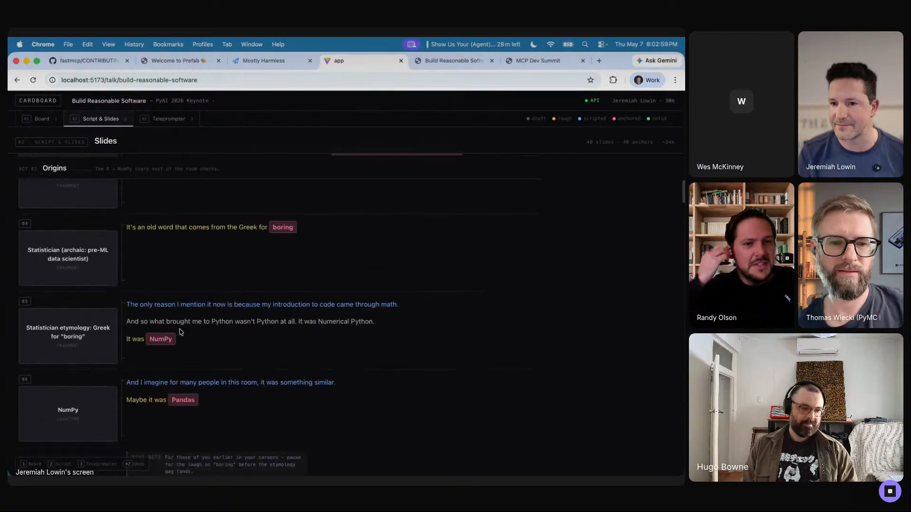
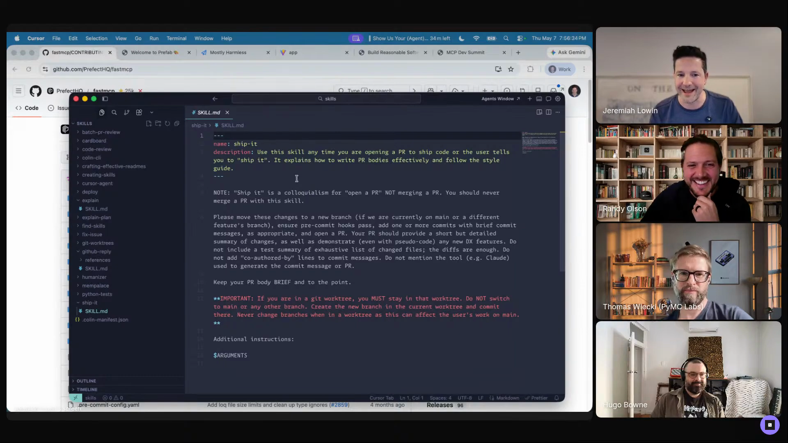
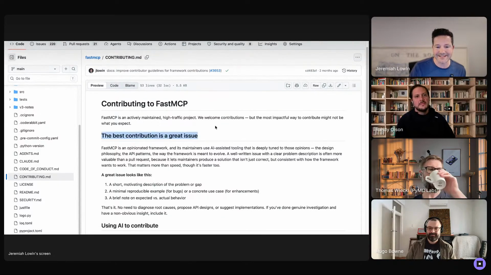
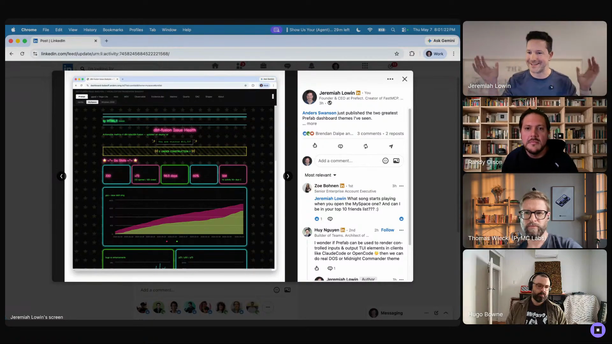

# second-brain

A personal agent harness fed by a daily voice-memo habit and run on a substrate whose memory the operator can muck around with directly. Captured from Jeremiah Lowin's episode 1 segment, where he names the second brain as both the thing he loves most about working with agents and the worst thing that could possibly get leaked.

## who showed it

Jeremiah Lowin is founder and CEO of Prefect, where he and his team build orchestration tools for data and AI workflows. He is also core maintainer of FastMCP and writes the blog *Mostly Harmless: Truly Artificial Intelligence*.

## the premise

Jeremiah's answer to *"what do you love most about working with AI agents"* is not productivity. It is having a place to put information now that pays out later:

> *"I use it as, like, a second brain, and so I have, I have big expectations about the information that I put in at a moment coming back out later."* [\[00:35:50\]](https://youtube.com/live/Pq3xuChdwxQ?t=2150)

> *"that's what I really love, is just pouring information in and then working to get it out."* [\[00:38:02\]](https://youtube.com/live/Pq3xuChdwxQ?t=2282)

The second brain is also the thing he names a few minutes later when asked what would scare him most if his agent skills got leaked:

> *"it's the same second brain that I love so much. It's all there, right? All my deepest and darkest fears and how I hate spiders and all that is probably in the brain of this thing."* [\[00:42:38\]](https://youtube.com/live/Pq3xuChdwxQ?t=2558)

That symmetry is the whole point. The reason the second brain pays out is that he has been pouring into it for years. The reason a leak would hurt is the same reason. There is no other version of the workflow where it isn't both at once.

## principles

### 1. Pour information in, in the moment it occurs

The voice memo is the showcase, not the entirety. The principle is that the brain is always accepting input, whether the input shows up at a desk, on a school-run, or on a walk.

> *"the truth is it'll be like I'm walking down the street and I'm like, 'Oh, here's an idea. Oh, we should name it that. Oh, we should do this.' And that can go in, if not in the moment, it can go into sort of this, this, this, I prefer to do in the morning, maybe I would do it in the evening, and now I've, like, teed up my agents."* [\[00:37:47\]](https://youtube.com/live/Pq3xuChdwxQ?t=2267)

This was a years-long habit before the agent substrate caught up to it. Jeremiah started recording meetings and morning voice memos years ago; the modern memory substrate is what made the deposit pay interest.

### 2. Treat voice as the natural input mode

The dominant input is a morning voice memo, often during the commute or school-run. The car ride is the budget:

> *"if I'm driving to my office, I have... and dropping off kids at school, I got, like, 30 minutes in the car, and so I kind of tee up my day. When I'm working from home, it's a much shorter voice memo, but I kind of tee up my day and I put that in."* [\[00:37:10\]](https://youtube.com/live/Pq3xuChdwxQ?t=2230)

What goes in the memo is not a task list. In the previous LLM era it would have been a system prompt for the day; in the memory-substrate era it is a delta on what the agents already know:

> *"in a previous era of LLMs, I'd be like, 'That's my system prompt for the day,' and it kind of affects everything. Now with more modern memory systems, it's sort of this update on what I've accomplished that might be out of sight for my agents, and that's been a huge unlock for me."* [\[00:37:22\]](https://youtube.com/live/Pq3xuChdwxQ?t=2242)

### 3. Pick a substrate whose memory you can muck with

The choice of base agent is determined by one criterion: can the operator reach in and change what the agent remembers. For Jeremiah, that is OpenClaw:

> *"this is one of the reasons that I use an OpenClaw, for example, so that I can go muck around with its memory, in a way that works for me. I don't know if my way would work for anyone else."* [\[00:36:04\]](https://youtube.com/live/Pq3xuChdwxQ?t=2164)

The *"I don't know if my way would work for anyone else"* is not throwaway. The brain is shaped by the operator's edits to its memory. A substrate that hides its memory hides the affordance the workflow depends on.

### 4. Split the agent stack by what's memory-bound vs. code-bound

One substrate cannot do everything well. Jeremiah runs two:

> *"I use OpenClaw as my main personal interface because of how I've customized its memory. When I'm working on code, I use Claude Desktop and Codex Desktop, which I migrated to from the CLIs mostly because of how much better it is at managing parallel sessions."* [\[01:03:08\]](https://youtube.com/live/Pq3xuChdwxQ?t=3788)

The cut is along the grain of the work: memory-bound asynchronous personal work goes to OpenClaw, where the customised memory is load-bearing; code work goes to the desktops, where parallel-session management is load-bearing.

> *"those are for my 'let's work on a thing, it's memory bounded' and I use an OpenClaw as my memory absorber for more asynchronous work."* [\[01:03:40\]](https://youtube.com/live/Pq3xuChdwxQ?t=3820)

## what a session looks like

There is no one session shape. The harness handles a few, and what ties them together is that the brain is the substrate for all of them.

**Morning deposit.** Voice memo on the commute or school-run, roughly thirty minutes; shorter when working from home. The deposit is not a task list but an update on what the operator has just done or is about to do, so the agents that already share memory get a delta rather than a re-introduction.

**Ad-hoc deposit.** An idea on a walk, a name for a thing, a fact from a meeting. Voiced into the brain in the moment, or queued for the next morning. The point is that the brain is always accepting input, so an idea is never lost to "I'll remember to write that down."

**Memory-bound asynchronous work.** Talking to Cardboard about an upcoming talk, asking OpenClaw to pull threads, working on a piece of personal software. The agent he uses is the brain-bearing one (OpenClaw), because work spans days and the memory continuity is the point. Cardboard is the worked example: *"I can, like, work on a talk, you know, feed in something tonight, close it, don't worry about it, talk to the agent about a thousand other things, and then I can come back and we can actually pick right up because of the memory substrate there."* [\[01:02:43\]](https://youtube.com/live/Pq3xuChdwxQ?t=3763)

The top of Cardboard, Jeremiah's personal slide tool. The layout (beats across columns, slides as cards) is his own vocabulary; he principally drives it from OpenClaw for memory continuity across sessions, though the software itself takes input from any agent over MCP. <a href="https://youtube.com/live/Pq3xuChdwxQ?t=3664">[01:01:04]</a>

## anti-patterns

- **Skipping the deposit habit.** Without a years-long pour-in habit, the brain has nothing to give back. The substrate is the easy part; the deposit is the work.
- **Using a substrate whose memory is opaque.** If the operator cannot edit what the agent remembers, the brain is shaped by the vendor, not the operator. This is the whole reason Jeremiah picked OpenClaw over a hosted assistant.
- **One substrate for everything.** OpenClaw is great for memory-bound asynchronous work; it is not what he reaches for to manage ten parallel coding sessions. Trying to force one tool across both ends produces a bad version of each.

## what you need

The pattern is substrate-agnostic in principle. Jeremiah's current setup, which is the one demoed on the show:

- **A base agent whose memory you can edit directly.** Jeremiah uses OpenClaw. The selection criterion is muckability; a substrate that hides its memory will not work for this.
- **A voice-memo habit and a place to record it.** The morning commute or school-run is the budget Jeremiah uses.
- **A meeting recorder.** Jeremiah has been recording meetings for years; this is one of the older feed pipes into the brain.

## watch it

- [**00:35:50**](https://youtube.com/live/Pq3xuChdwxQ?t=2150): The second brain framing. *"big expectations about the information that I put in at a moment coming back out later."*
- [**00:36:04**](https://youtube.com/live/Pq3xuChdwxQ?t=2164): Why OpenClaw. The muck-with-memory criterion.
- [**00:37:01**](https://youtube.com/live/Pq3xuChdwxQ?t=2221): The morning voice memo and the school-run as the deposit budget.
- [**00:37:22**](https://youtube.com/live/Pq3xuChdwxQ?t=2242): System prompt for the day, then a delta in the memory-substrate era.
- [**00:37:47**](https://youtube.com/live/Pq3xuChdwxQ?t=2267): The walking-down-the-street deposit.
- [**00:42:38**](https://youtube.com/live/Pq3xuChdwxQ?t=2558): The same brain that he loves is the worst thing that could leak.
- [**01:02:43**](https://youtube.com/live/Pq3xuChdwxQ?t=3763): The asynchronous, resumable shape of memory-substrate work, with Cardboard as the worked example.
- [**01:03:08**](https://youtube.com/live/Pq3xuChdwxQ?t=3788): The editor/agent split. OpenClaw for memory, Desktops for parallel code.

---

## personal software

A theme Jeremiah names at the top of his segment and returns to throughout: the agent stack makes custom, single-user software newly cheap, and that changes what is worth building. This section is not a separate workflow so much as the wider frame Jeremiah keeps returning to alongside the second-brain practice above.

> *"I think that's kind of a theme of what I want to talk about today, is sort of, like, custom software or just-in-time software or something like that."* [\[00:36:13\]](https://youtube.com/live/Pq3xuChdwxQ?t=2173)

> *"I'm into personal software basically in the most true sense, right?"* [\[00:56:36\]](https://youtube.com/live/Pq3xuChdwxQ?t=3396)

What follows is the showcase: the principles of personal software as Jeremiah practises it, then the artifacts he showed (FastMCP's contributing discipline, the skill collection, Prefab, Cardboard).

### built for one user, that user is you

Cardboard is the purest expression. It is software Jeremiah wrote for his own talk-writing process, with a vocabulary (acts, beats, slides, colour-coded speaker notes) that nobody else uses.

> *"this is the latest version of a piece of software that I call Cardboard, which is for laying out my conference talks as cards, like on a board, and follows a vocabulary that I've developed, purely for me, like no one else should use it, where I think of my talks as having acts and beats, and then within those beats we have slides."* [\[01:00:43\]](https://youtube.com/live/Pq3xuChdwxQ?t=3643)

The point is not that it cannot be shared; it is that the design constraint is "fits Jeremiah," and the shareable version is a secondary question. He used it to prepare his PyAI keynote and is using it for an upcoming PyData London talk.

### the UI is read-only; the agent is the editor

The central design principle of Jeremiah's personal software: the artifact is observed in a UI, edited through whichever agent the operator chooses to drive it.

> *"this is not an interactive UI. This is read only... I interact with this entirely over an API or an MCP server, talking to it from any agent I want that can connect to it."* [\[01:02:07\]](https://youtube.com/live/Pq3xuChdwxQ?t=3727)

This is the design rule that makes personal software cheap to build. Read-only UIs need no form validation, no edit conflicts, no permissions model. The expensive bits live in the agent layer, which the operator did not have to write.

Cardboard's read-only slides view, with speaker notes and pink highlight pills marking key terms. Nothing on this page is editable in the UI; the only way to change it is to ask the agent. <a href="https://youtube.com/live/Pq3xuChdwxQ?t=3685">[01:01:25]</a>

### vocabulary as policy

A second instance of "built for one user" applied to a multi-user thing: the skills Jeremiah uses on his own machine encode his personal vocabulary and preferences, and the agent translates them into deterministic behaviour. [`ship-it`](../../skills/ship-it) is the cleanest example:

> *"I'm always like, 'Ship this.' It means open a PR. It does not mean merge the code. That's bitten me a lot. Most LLMs think 'ship it' means, like, merge it. That's not how I use it."* [\[00:54:58\]](https://youtube.com/live/Pq3xuChdwxQ?t=3298)

> *"Why does this skill exist? It's not a useful skill. I haven't even read this skill in, like, a year probably. It seems like a really stupid skill, actually. But the reason it exists is because I want to write the words 'ship it' and have the right outcome happen, and this skill is my bridge to ensuring that. And, like, that's how we use skills."* [\[00:55:20\]](https://youtube.com/live/Pq3xuChdwxQ?t=3320)

The `ship-it` skill on screen. Description: the personal vocabulary bridge for "ship it" so the agent opens a PR instead of merging. <a href="https://youtube.com/live/Pq3xuChdwxQ?t=3300">[00:55:00]</a>

[`github-reply`](../../skills/github-reply) is the same idea applied to tone. The skill exists because the LLM's default tone for contributor replies is wrong in a specific, repeatable way:

> *"don't say, 'Great work,' followed by a rejection. That's confusing... It's not because I'm trying to masquerade it as me. I'm usually pretty obvious if I'm using an LLM to draft the reply. It's because I think there's a right way to treat people, and the LLM doesn't do it."* [\[00:54:22\]](https://youtube.com/live/Pq3xuChdwxQ?t=3262)

[`explain`](../../skills/explain) is the same idea applied to status checks across parallel coding sessions. The verb is *"explain"*, and the skill encodes what Jeremiah means by it — not a line-by-line diff, not a generic code walkthrough, but a colleague-level handoff. The skill is ~80 lines and there is one sentence in it that does the work:

> *"there's only one sentence that actually matters in it, and it's been in every version of the skill, and it says, 'Talk to me like you're explaining this to your colleague who knows about your project but wants to understand what you just did.'"* [\[00:46:43\]](https://youtube.com/live/Pq3xuChdwxQ?t=2803)

The context the skill is built for:

> *"I'm running 10 different agents on 10 different things over 10 different timeframes, and I'm cracking open my laptop with a coffee and I'm like, 'What's this one?'"* [\[00:46:55\]](https://youtube.com/live/Pq3xuChdwxQ?t=2815)

The pattern: pick a verb the operator uses naturally (*"ship it"*, *"reply to this"*, *"explain"*), and write a skill that makes the verb deterministic. Skills become a personal vocabulary the agent obeys.

### skills are living documents

Skills are not write-once. Jeremiah's folder of about twenty skills is constantly under revision:

> *"I like to think of skills as living documents, which is one of the reasons that it's nice that they're on your machine, but there's also kind of makes distribution hard. So my skills... where I have, you know, 20-odd skills in it. Most of these skills are changing as I... I'm like, 'Oh, this didn't work.'"* [\[00:53:48\]](https://youtube.com/live/Pq3xuChdwxQ?t=3228)

The corollary on the receiving end is the ClawHub power law: a small number of community skills are popular; most of the rest the operator already knows and doesn't need.

### say no when contributions don't belong in the shared thing

The same "built for one user" instinct, projected outward onto a multi-user artifact, is the right policy for OSS frameworks. The agent default (accept this PR if only you change X) is wrong for a framework, because frameworks succeed by *not* growing:

> *"the way agents review code, for whatever reason, seems to have a bias that the PR should be accepted, and if only you change these things, it will be accepted. And this is the wrong approach for a framework. Frameworks should not be modified unless whatever is coming in is so overwhelmingly useful to an overwhelming majority of users that the framework should take it on."* [\[00:39:42\]](https://youtube.com/live/Pq3xuChdwxQ?t=2382)

The discipline Jeremiah and fellow maintainer Bill Eastin landed on for FastMCP is the same instinct applied at the project level: turn contributions into issues, let each operator's agent implement the feature in their own fork or app, keep the framework lean.

> *"this is kind of the headline. The best contribution is a great issue."* [\[00:44:07\]](https://youtube.com/live/Pq3xuChdwxQ?t=2647)

The FastMCP `CONTRIBUTING.md` doc on screen, with "The best contribution is a great issue" as the headline. The discipline is written into the project's own onboarding. <a href="https://youtube.com/live/Pq3xuChdwxQ?t=2647">[00:44:07]</a>

That requires a manual loop on review, even though everything else in his stack is agent-driven:

> *"my workflow is surprisingly manual on FastMCP. I will spin up agents to both write my code and review others' code, but ultimately, I will step in, and I will look at it, and I will work on it. And it's probably a lot slower than it would be otherwise."* [\[00:45:26\]](https://youtube.com/live/Pq3xuChdwxQ?t=2726)

The taste he encodes (what belongs in the framework, what doesn't) is the part the agents cannot do on their own. The whole maintenance section is "personal software" thinking applied to a project everyone shares: keep the shared thing small, push the personal customisation out into the consumer's stack.

### Prefab: the Python frontend for one-person dashboards

Jeremiah also showed Prefab, which started inside FastMCP and spun out a few weeks before the show. Same logic, different layer:

> *"I desperately wanted to create MCP apps in Python, and that meant I needed a Python front-end framework that didn't require a backend, which almost every one of them assumes a very specific backend, which we don't get here. We have an MCP server."* [\[00:57:39\]](https://youtube.com/live/Pq3xuChdwxQ?t=3459)

Prefab is what you reach for when the personal software you want to build is a dashboard. The MCP-app-in-Python framing is the wedge; the broader use case is internal data dashboards distributing information inside one team, which Jeremiah names as the dominant use case for MCP in enterprises.

A Prefab dashboard styled as a MySpace theme by Anders Swanson at dbt Labs, surfaced on Jeremiah's LinkedIn during the demo. The same Prefab base, rendered with someone else's taste. <a href="https://youtube.com/live/Pq3xuChdwxQ?t=3588">[00:59:48]</a>

### a note on what gets shared

The collection of skills (`explain`, `ship-it`, `github-reply`, the skill-for-writing-skills meta-skill) plus Prefab plus Cardboard cover the spectrum from "everyone should use this" through "a few people might use this" to "literally only Jeremiah will use this." The point of the personal-software ethos is that this whole spectrum is now worth building. The skills in this repo are the share-friendly end of that spectrum; the rest stays personal.

## see also

- [`skills/explain/`](../../skills/explain), [`skills/ship-it/`](../../skills/ship-it), and [`skills/github-reply/`](../../skills/github-reply) for the three skills Jeremiah authorised this repo to ship, each demoed in his segment.
- Jeremiah's blog *Mostly Harmless: Truly Artificial Intelligence*, including *An Open Source Maintainer's Guide to Saying No*, the longer-form essay behind the maintenance philosophy in this section.
- FastMCP and its contributing doc for the project that the OSS-maintenance story is set inside.
- [`workflows/personal-agent-harness/`](../personal-agent-harness) for Eleanor Berger's adjacent practice: a personal agent on segregated hardware, accessed from anywhere, with a related substrate-and-skills shape but a different security model and a different daily input habit.
