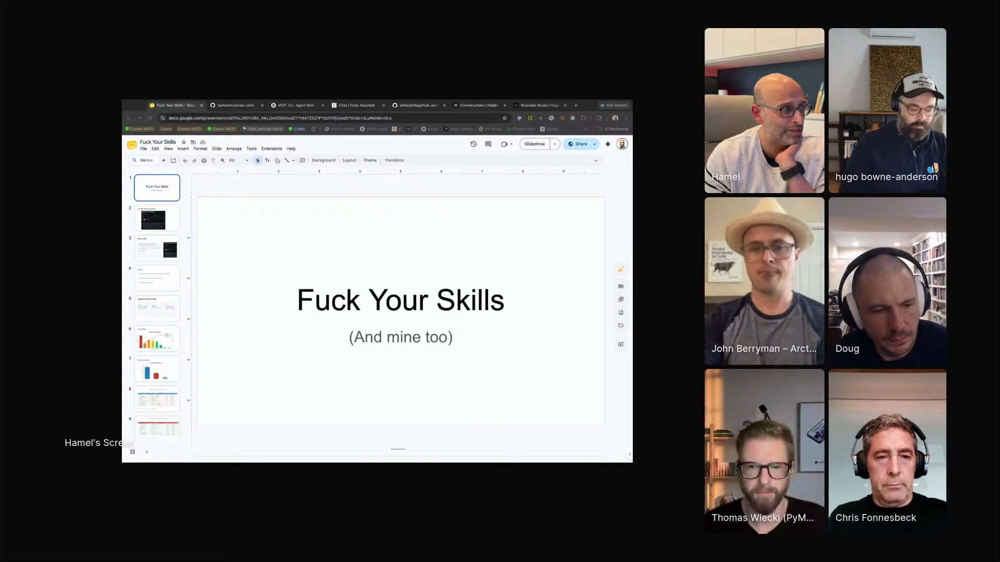
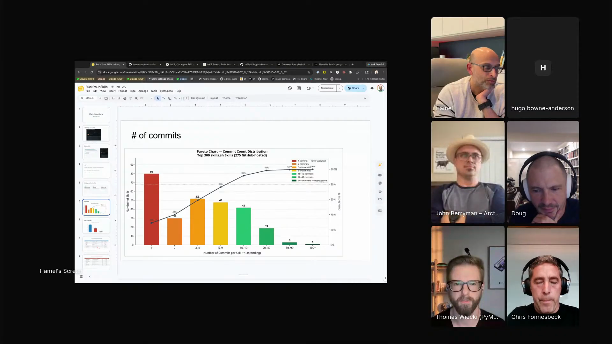
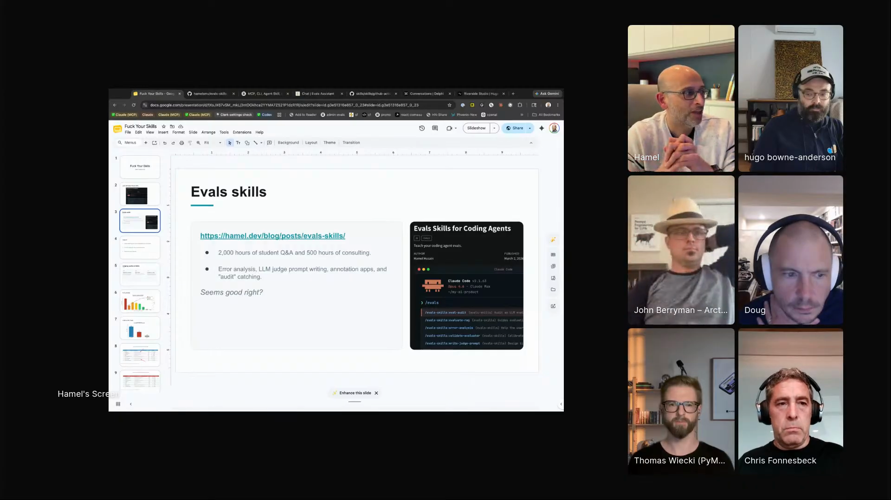
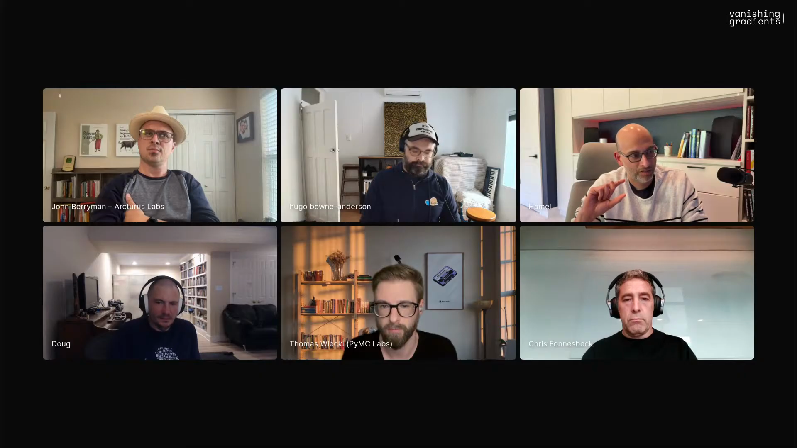
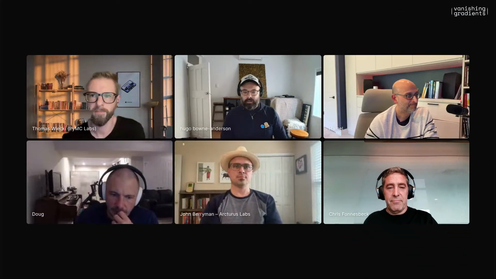

# skill-scepticism

Hamel's "Fuck Your Skills" workflow: a review loop for deciding whether a shared agent skill deserves trust, adaptation, replacement, or rejection.

> *"When you see a skill, you should whisper to yourself, maybe fuck your skills, including my skills. Don't trust anyone's. Even if they're my skills, just be careful."* [[00:32:20]](https://youtube.com/live/XaYQFtca798?t=1940)

Captured from his episode 4 segment, where he put his own eval skills on blast, inspected public skills through `skills.sh`, and still landed on a useful version of the pattern: shared skills can transmit working practice, but only after you read them like code.

Hamel opens the screen-share portion of his segment with the title slide: <em>"Fuck Your Skills"</em>, and underneath it, <em>"(And mine too)"</em>. <a href="https://youtube.com/live/XaYQFtca798?t=1325">[00:22:05]</a>

## who showed it

[Hamel Husain](https://hamel.dev/) is a machine learning engineer with more than 20 years of experience across Airbnb, GitHub, DataRobot, and his current evals work. Hugo introduces him as someone who has done early LLM research used by OpenAI for code understanding, and as someone working to bring data science back to AI by helping teams debug, analyze, and measure agentic systems.

## the premise

The workflow starts from a deliberately uncomfortable claim: a lot of public skills are slop with a nicer file extension. Some are AI-written prompt dumps. Some have one commit and no evidence that the author uses them. Some compress thousands of hours of hard-won knowledge into a markdown file and accidentally make users feel done.

That does not make skills useless. It changes the default action. Do not install a skill because it exists, went viral, or came from someone smart. Intake it. Read it. Check whether it is maintained. Ask what useful constraint it adds. Decide whether it should become part of your system, be rewritten for your context, point to a richer source, or be ignored.

## principles

### 1. Read the skill before you trust the skill

Hamel's minimum rule is blunt:

> *"look at the prompt and look at the skill"* [[00:21:08]](https://youtube.com/live/XaYQFtca798?t=1268)

This is not a ceremonial read-through. You are looking for what the file actually tells the agent to do, what it assumes about the operator, what tools it calls, what files it touches, and whether the author has hidden "just trust me" inside a wall of plausible markdown.

### 2. Treat a shared skill like code from GitHub

The trust question is not "does the README sound smart?" It is "would I run this in my environment?"

> *"It's kind of like how you would judge code on GitHub in a lot of ways. It's like, I try to see like, what are some signals, you know, that you should take this skill seriously."* [[00:35:22]](https://youtube.com/live/XaYQFtca798?t=2122)

Those signals include who published it, whether you trust them, whether the author appears to use it, whether it has changed over time, how stale it is, and whether the skill is just a prompt or contains concrete code, tools, tests, examples, or operating constraints.

### 3. One commit is not a conviction, but it is a smell

Hamel is careful not to turn commit count into dogma. A comedy skill may need one commit. A skill that claims to encode a serious workflow probably deserves more evidence.

> *"if it's not being iterated on, you have to tune up your skepticism a little bit and say, maybe this skill is very shallow and the ceiling might be very low in terms of what the skill is imparting to you because it's not being iterated on."* [[00:29:27]](https://youtube.com/live/XaYQFtca798?t=1767)

The point is not shame. The point is intake. A stale, one-commit skill can still be useful as a sketch, a prompt reference, or a source of vocabulary. It should not silently become policy.

Hamel using `skills.sh` as an inspection surface: sort public skills, look at commits, then decide how much skepticism to apply. <a href="https://youtube.com/live/XaYQFtca798?t=1762">[00:29:22]</a>

### 4. Prefer constraints over prompt cosplay

For Hamel, a skill earns value by constraining the agent in useful ways. A single prompt in a single file may still help, but it is weaker evidence than code, tools, examples, or a tested procedure.

> *"If it's just a single prompt in a single file, that seems a little bit less useful, honestly. If it's like a bunch of code tools, things like that, that's more of a signal that is like trying to constrain your agent more."* [[00:28:25]](https://youtube.com/live/XaYQFtca798?t=1705)

This is where "skill" stops meaning "magic markdown" and starts meaning "a durable way to steer work." The file is not the artifact. The constraint is.

### 5. Watch for false done-ness

Hamel's strongest critique is about user behavior. A skill can make an operator feel like they have absorbed a practice when they have only installed a file.

> *"people will feel like they're done. Like you have this eval skill, you must be doing it right."* [[00:24:42]](https://youtube.com/live/XaYQFtca798?t=1482)

The trap of high-status skills: they can make a team feel covered before they have done the real eval work. <a href="https://youtube.com/live/XaYQFtca798?t=1482">[00:24:42]</a>

That is why the intake loop includes an explicit "what work would still be required?" step. A skill can be a start, a checklist, a reminder, or a prompt for deeper research. It is rarely the finish line.

### 6. Replace lossy markdown with higher-fidelity systems when the domain is deep

Hamel's own eval skills are the cautionary example. He had thousands of hours of course instruction, office hours, Q&A, student questions, and nuanced cases. A markdown skill could not hold that.

> *"it's unreasonable to just push them all into a skill. Because a skill is like a compression, right? And like, like I said, people over-rely on the skill."* [[00:25:34]](https://youtube.com/live/XaYQFtca798?t=1534)

His replacement was a course chatbot and MCP that could search the underlying knowledge instead of pretending the skill file had captured it all.

> *"The reason this is better, because now you have more fidelity for like the kind of information I'm trying to give people. I'm like, okay, this is higher fidelity. You can actually get answers to your nuance question and you can go like way further."* [[00:26:56]](https://youtube.com/live/XaYQFtca798?t=1616)

### 7. Share workflows, then let people make them personal

Hugo pushes back on the "don't use other people's skills" reading. The valuable part of sharing may be that a skill transmits a way of working, then another builder adapts it.

> *"it's a way of not only steering and constraining an agent, but sharing via some form of instructional memory our workflows with each other that then become personalized."* [[00:34:48]](https://youtube.com/live/XaYQFtca798?t=2088)

Hamel accepts the sharing point, while keeping the review posture:

> *"Yeah, I think the sharing part is definitely very, very good."* [[00:35:01]](https://youtube.com/live/XaYQFtca798?t=2101)

So the intake decision is not just accept/reject. The best answer is often "fork the idea, rewrite the instructions, keep the taste."

### 8. The best skills may come from watching the first messy run

Hamel's favorite use of skills is not a public marketplace skill at all. It is a skill created after the agent has done a painful browser task once, watched the network, learned the internal routes, and captured the repeatable procedure.

> *"I tell it to do a task, but while it's doing that task, I tell it to introspect. the internal API of that site and like pay attention to what the routes are and how to programmatically like do all the things."* [[00:42:32]](https://youtube.com/live/XaYQFtca798?t=2552)

The positive version of skills: use the first browser run to discover routes, requests, cookies, and internal APIs, then save the repeatable procedure. <a href="https://youtube.com/live/XaYQFtca798?t=2606">[00:43:26]</a>

This is a useful counterweight to the marketplace critique. Some skills are shallow because they started as content. Others are strong because they started as work.

## the intake loop

1. **Name the claimed job.** Write down what the skill is supposed to help with, and what "better" would mean: faster, safer, more accurate, less context-heavy, more consistent, more teachable.
2. **Open the source.** Read the `SKILL.md`, prompts, linked scripts, tools, examples, and any setup instructions. If it touches the shell, network, credentials, browser, or personal data, inspect that path first.
3. **Check provenance.** Who wrote it? Do you trust them? Are they likely to use it themselves? Is it a one-off post, a course artifact, an internal tool they have used for months, or a living repo?
4. **Check maintenance signals.** Look at commit history, age, issue/PR activity, and whether the examples still match current tools. One commit is not fatal; one commit plus a sweeping claim is spicy.
5. **Classify the artifact.** Is it prompt-only, code-backed, tool-backed, docs-map, workflow description, or retrieval/MCP-backed? The classification tells you how much faith to place in the file.
6. **Run it in a low-risk context.** Use a toy repo, a copied file, or a dry-run mode. Watch what files it reads and writes. Keep the first run observable.
7. **Decide the disposition.** Accept, adapt, extract the prompt, rewrite as your own workflow, replace with a blog/docs pointer, replace with an MCP/retrieval tool, or reject.
8. **Install only the adapted version.** If it enters your harness, make it yours: scoped directory, local examples, current tool names, your security defaults, and a note about when not to use it.

## anti-patterns

- **Skill hoarding.** Loading every plausible skill because discovery is fun. Context gets noisy, instructions conflict, and stale advice starts steering real work.
- **Installing vibes.** Trusting a skill because the author is famous, the screenshot looks good, or the thread got traction.
- **Prompt laundering.** Wrapping a prompt in a skill file and pretending it became an operating procedure.
- **False done-ness.** Treating "I installed the eval skill" as equivalent to doing evals.
- **Ignoring source visibility.** Previewing markdown but not reading source, scripts, hidden HTML, linked tools, or network calls.
- **Outsourcing taste.** Adopting someone else's preferences wholesale, then wondering why your outputs all look like theirs.
- **Compressing deep knowledge too hard.** Turning an entire course, community, or expert practice into one markdown checklist when the actual job needs retrieval, tools, or conversation.

The mood, basically: <em>"maybe fuck your skills, including my skills."</em> Not anti-skill, just anti-sleepwalking. <a href="https://youtube.com/live/XaYQFtca798?t=1940">[00:32:20]</a>

## what you need

- **A skill or workflow artifact to inspect.** Public repo, local skill folder, marketplace listing, copied prompt, or a guest's shared procedure.
- **Source access.** Read the actual files, not just rendered markdown or social preview screenshots.
- **A low-risk harness.** A toy project, scratch directory, or safe browser session where the first run cannot do expensive damage.
- **Provenance signals.** Author, usage evidence, commit history, age, examples, issues, and whether the author has a reason to keep the skill alive.
- **Your own scoped memory/skills repo.** Hamel keeps skills and markdown memory in a structured monorepo so context does not become soup.
- **An escalation path.** Blog post, docs pointer, MCP, retrieval tool, code harness, or browser-internal-API skill when static markdown is too lossy.

## watch it

Hamel after Hugo's pushback: sharing workflows is good, but the intake posture still looks like reviewing code from GitHub. <a href="https://youtube.com/live/XaYQFtca798?t=2122">[00:35:22]</a>

- [**00:20:18**](https://youtube.com/live/XaYQFtca798?t=1218): Many public skills are made for Twitter, not maintained use.
- [**00:21:08**](https://youtube.com/live/XaYQFtca798?t=1268): "look at the prompt and look at the skill."
- [**00:23:18**](https://youtube.com/live/XaYQFtca798?t=1398): Hamel shows his eval-related skills.
- [**00:24:42**](https://youtube.com/live/XaYQFtca798?t=1482): False done-ness: "you have this eval skill, you must be doing it right."
- [**00:25:34**](https://youtube.com/live/XaYQFtca798?t=1534): A skill is lossy compression.
- [**00:26:56**](https://youtube.com/live/XaYQFtca798?t=1616): Why Hamel prefers the course chatbot/MCP for nuanced eval questions.
- [**00:28:02**](https://youtube.com/live/XaYQFtca798?t=1682): Prompt-only versus code/tool-backed skills.
- [**00:29:04**](https://youtube.com/live/XaYQFtca798?t=1744): `skills.sh` as a discovery and analysis surface.
- [**00:29:27**](https://youtube.com/live/XaYQFtca798?t=1767): Commit history as a skepticism trigger.
- [**00:30:02**](https://youtube.com/live/XaYQFtca798?t=1802): Do not adopt someone else's prompts wholesale.
- [**00:32:20**](https://youtube.com/live/XaYQFtca798?t=1940): "maybe fuck your skills, including my skills."
- [**00:34:48**](https://youtube.com/live/XaYQFtca798?t=2088): Hugo's pushback: shared skills as instructional memory that becomes personal.
- [**00:35:22**](https://youtube.com/live/XaYQFtca798?t=2122): Judge skills like code on GitHub.
- [**00:36:56**](https://youtube.com/live/XaYQFtca798?t=2216): Hamel's scoped monorepo for skills and markdown memory.
- [**00:38:42**](https://youtube.com/live/XaYQFtca798?t=2322): Point agents at your own blog posts.
- [**00:42:32**](https://youtube.com/live/XaYQFtca798?t=2552): Browser-internal-API skill workflow.
- [**00:44:11**](https://youtube.com/live/XaYQFtca798?t=2651): A walkthrough video can be enough input for an agent to recreate a workflow.

## see also

- [Hamel's evals skills](https://github.com/hamelsmu/evals-skills), the artifact he shows and critiques.
- [Hamel's AI evals course](https://maven.com/parlance-labs/evals), the deeper knowledge source behind those skills.
- [skills.sh](https://skills.sh/), the public-skill discovery surface Hamel uses for the commit-history analysis.
- [Anthropic's front-end design skill](https://github.com/anthropics/skills/blob/main/skills/frontend-design/SKILL.md), the popular prompt-only skill Hamel points to as a useful but flattening example.
- [The Maven internal-API walkthrough](https://www.youtube.com/watch?v=rOaaibIFf8o), the video Hamel names for the browser workflow.
- [`workflows/personal-agent-harness/`](../personal-agent-harness) for another way guests keep agent behavior personal instead of accepting defaults.
- [`workflows/second-brain/`](../second-brain) for Jeremiah Lowin's adjacent frame: personal software, living skills, and vocabulary as policy.
