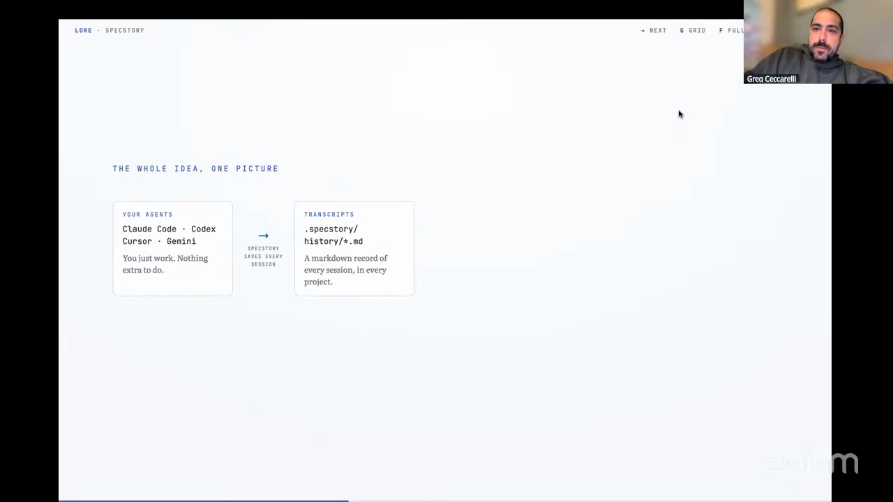
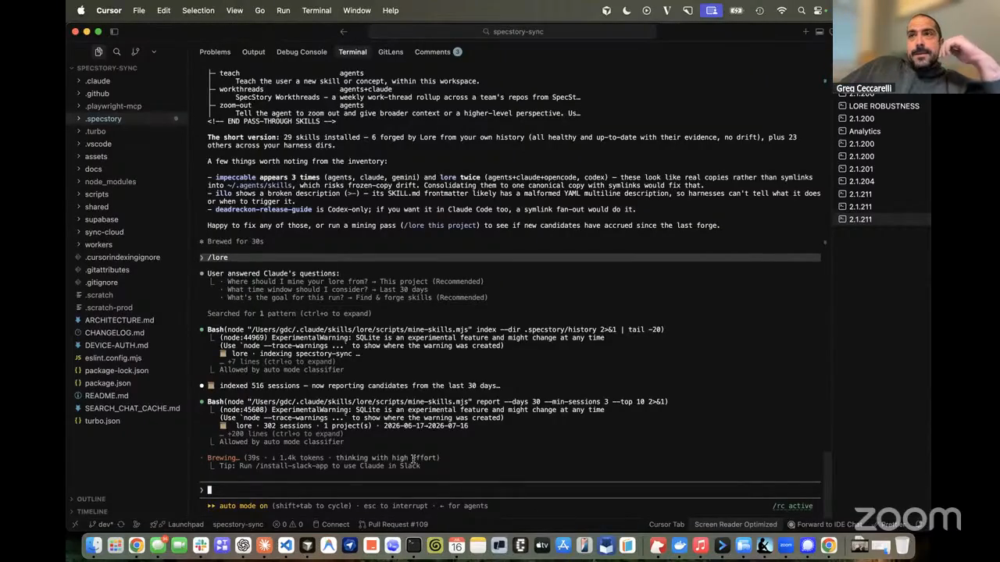
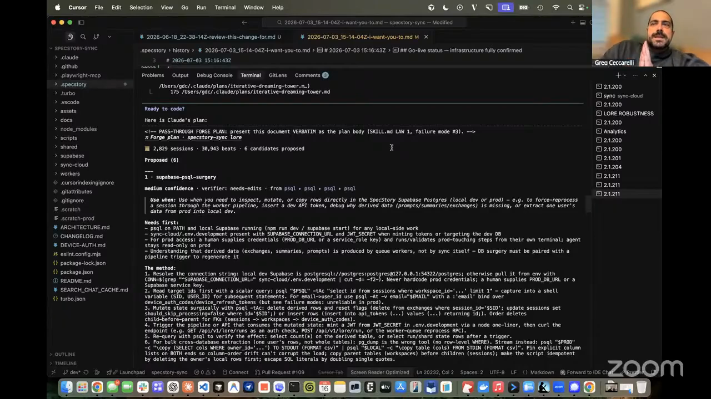
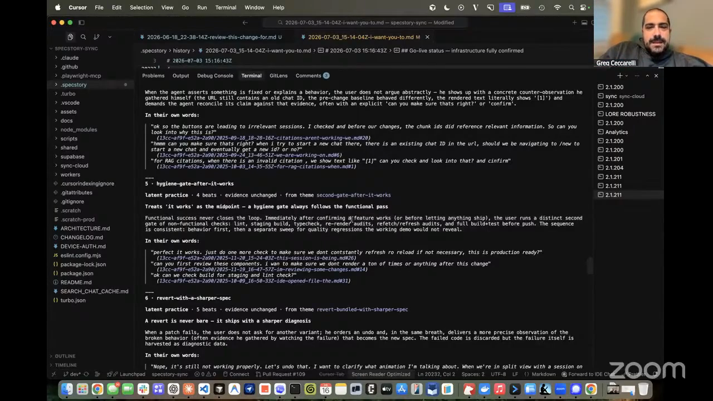
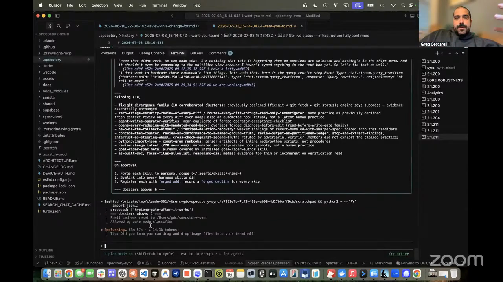

# skills from agent history

Greg Ceccarelli uses saved coding-agent sessions as a corpus for discovering repeated working practices. In his Episode 7 demo, Lore reduces histories into beats that include a downstream user-response signal, corroborates candidate skills across projects, presents dossiers with citations, and waits for Greg to decide whether anything should be installed.

The implementation Greg showed is available in [`skills/lore/`](../../skills/lore). This README extracts the operating pattern from Greg's SpecStory and Lore setup.

## who showed it

[Greg Ceccarelli](https://www.gregceccarelli.com/) is co-founder and CPO of [SpecStory](https://specstory.com/). He previously served as CPO at Pluralsight and worked at GitHub, Dropbox, and Google. SpecStory saves coding-agent sessions from multiple harnesses in a common markdown format.

## the premise

Finished code records what survived. Agent sessions retain the commands, corrections, decisions, preferences, and verification habits that produced it. Those traces are the raw material for identifying practices a user repeats without having named or documented them.

> *"Storing transcripts, storing your traces, whatever you want to call them, your agent sessions, is really important because to do useful things, if you were going to try and extract decisions or the why, you need that raw material."* [[00:05:33]](https://youtube.com/live/kfCi2EBu-nc?t=333)

The workflow turns that raw material into a controlled learning loop. Deterministic processing makes a large corpus tractable. Model-driven mining looks for recurring practices. Evidence and human review decide which candidates deserve to become durable instructions.

Greg's input pipeline: sessions from several coding agents become markdown transcripts inside the project. <a href="https://youtube.com/live/kfCi2EBu-nc?t=755">[00:12:35]</a>

## principles

### 1. Preserve the sessions before trying to learn from them

The workflow needs the full interaction history, not only code diffs or a summary generated after the fact. Corrections, rejected suggestions, repeated constraints, and the sequence of user responses carry much of the evidence.

> *"A lot of the patterns and heuristics that you use are actually in those agent session logs."* [[00:06:03]](https://youtube.com/live/kfCi2EBu-nc?t=363)

### 2. Normalize histories from every harness

Put sessions from different agents into one inspectable representation. Greg uses SpecStory to write Claude Code, Codex, Cursor, Gemini, and other supported histories into markdown in the project repository. A common format lets one mining pass compare work across tools and projects.

> *"It makes it really easy to get all of those session logs into one common format and markdown into your project repo."* [[00:12:31]](https://youtube.com/live/kfCi2EBu-nc?t=751)

### 3. Reduce the corpus deterministically before asking a model to judge it

Greg separates repeatable parsing, indexing, initial pattern extraction, retrieval, and counting from model-driven theme analysis and adjudication. The deterministic layer supports repeated runs over the same directory and prevents a large archive from being pushed wholesale into an LLM.

> *"There's actually two parts to this. So there's a deterministic part, and then there's a non-deterministic part."* [[00:19:16]](https://youtube.com/live/kfCi2EBu-nc?t=1156)

> *"If you were actually trying to push this all to an LLM, it would not be very happy, and it would consume all of your usage very quickly."* [[00:19:58]](https://youtube.com/live/kfCi2EBu-nc?t=1198)

Lore selects 516 sessions from the last 30 days, checks the indexed corpus, then begins its high-reasoning mining pass. <a href="https://youtube.com/live/kfCi2EBu-nc?t=1160">[00:19:20]</a>

### 4. Include the next user turn as outcome evidence

A prompt and response reveal what the agent attempted. The next user prompt provides a signal Lore uses to infer whether the user accepted the result, corrected it, rejected it, or changed direction. Lore calls this three-part unit a beat and labels it before looking for patterns.

> *"That's a beat instead of just a user prompt, agent response, because what it tries to do is see, did you actually accept what came out of the response from your prior prompt and label it."* [[00:20:42]](https://youtube.com/live/kfCi2EBu-nc?t=1242)

### 5. Spend model reasoning on narrowed candidates

Theme sweeps, deeper mining, and adjudication happen after deterministic reduction. Greg uses a high-reasoning model for this stage and treats it as an occasional maintenance pass rather than a continuous background process.

> *"You don't need to do these Lore runs that often. I would say once a month or something, to see what comes out. It's nice to use a really extra high-reasoning model, so you get something that might actually be something you want to install."* [[00:27:57]](https://youtube.com/live/kfCi2EBu-nc?t=1677)

### 6. Require corroboration, citations, and a readable dossier

A repeated phrase is not yet a reusable practice. Lore checks whether a pattern recurs across sessions and projects, adjudicates whether it is worth showing, and produces a dossier with the source histories. Patterns that lack enough evidence or are not adjudicated as relevant and important are skipped before the review stage.

> *"The corroboration engine worked. It did all this latent theme analysis. It did some adjudication to understand if that pattern was one worth presenting. And then what it does is it writes dossiers."* [[00:30:16]](https://youtube.com/live/kfCi2EBu-nc?t=1816)

> *"The skill and this engine will actually present you the citations of where in your history files it found this pattern for you."* [[00:31:59]](https://youtube.com/live/kfCi2EBu-nc?t=1919)

The narrowed review set: 2,829 accumulated sessions, 30,943 beats, and six proposed candidates, each followed by its dossier. <a href="https://youtube.com/live/kfCi2EBu-nc?t=1827">[00:30:27]</a>

The live run surfaced a practice Greg recognized: after functional success, he performs a separate quality-regression sweep with linting, type checks, builds, refreshed audits, re-rendered artifacts, and a test push.

A candidate Greg recognized in his own work: a second hygiene gate after the functional pass. The dossier includes the inferred practice and cited examples in his own words. <a href="https://youtube.com/live/kfCi2EBu-nc?t=1963">[00:32:43]</a>

### 7. Keep installation and deletion under human control

The miner proposes. The user decides whether a candidate is specific, durable, and useful enough to influence future agents. Approval is per candidate. The generated skill remains reviewable after installation and can be uninstalled if the artifact is not worth keeping.

> *"It presents stuff for your review. It will never install anything unless you actually approve it."* [[00:34:12]](https://youtube.com/live/kfCi2EBu-nc?t=2052)

> *"It produced this. I don't know if this is actually something that I want."* [[00:36:37]](https://youtube.com/live/kfCi2EBu-nc?t=2197)

The approval boundary. Lore shows what it skipped, what approval will do, and the dossier count before asking Greg to forge anything. <a href="https://youtube.com/live/kfCi2EBu-nc?t=2055">[00:34:15]</a>

## what a session looks like

1. **Capture and normalize histories.** Save complete sessions from the coding agents used across the project and convert them into one durable, inspectable format.
2. **Inventory existing skills.** Check what is already installed, where copies or symlinks live, and which instructions may already cover a candidate practice.
3. **Scope the run.** Choose the project, time window, and goal for the run. Greg selects the current project, the last 30 days, and candidate discovery in the demo. Lore later corroborates those candidates against evidence retained from earlier project runs.
4. **Index sessions into beats.** Parse each user prompt, agent response and actions, and subsequent user prompt. Label acceptance, correction, rejection, and other outcome signals.
5. **Mine themes.** Run model-driven theme sweeps and deeper analysis over the reduced corpus, not the raw archive.
6. **Corroborate and adjudicate.** Look for recurrence across sessions and projects. Skip patterns without enough evidence or importance to justify review.
7. **Render candidate dossiers.** For every surviving practice, show its proposed scope, the behavior it would teach, and citations back to the source histories.
8. **Review candidates individually.** Inspect the cited evidence and compare the proposal with how the user wants future agents to behave. Approve or reject each candidate.
9. **Forge approved skills.** Convert only approved candidates into installed skill packages, then make them available to the relevant agent harnesses.
10. **Inspect and prune.** Review the generated skill and uninstall it if the artifact is too narrow, redundant, misleading, or no longer wanted.

## anti-patterns

- **Sending the raw archive directly to an LLM.** Large session histories consume context and usage before the model reaches the judgment-heavy part of the work.
- **Mining prompt-response pairs without the next user turn.** This removes a useful downstream signal that the previous response was accepted, corrected, or rejected.
- **Turning one occurrence into a permanent instruction.** A one-off request may belong to a task, not to the user's durable working style.
- **Showing bare candidate names.** A human cannot judge a proposed skill without its behavior, scope, corroborating evidence, and source citations.
- **Approving every plausible candidate.** Installed skills can trigger from ordinary language and quietly change agent behavior. Generic or narrow candidates create instruction clutter.
- **Treating installation as the end of review.** The generated `SKILL.md` may still be poor. Read it, test it, and remove it if it does not encode the intended practice.
- **Running deep mining constantly.** Greg recommends an occasional high-reasoning run, roughly monthly, to improve the chance that the result contains something worth installing.

## what you need

Greg's implementation, which is the one shown on the episode, uses:

- **Durable agent-session histories.** Full prompts, agent responses and actions, and subsequent user turns from the coding work you want to learn from.
- **A common representation.** Greg uses [SpecStory](https://specstory.com/) to normalize histories from multiple coding agents into markdown inside project repositories.
- **A deterministic corpus layer.** An index or local database that can parse sessions into beats, perform initial pattern extraction, count recurrence, retrieve evidence, and support repeatable runs without asking a model to reread everything.
- **A reasoning model.** Used after reduction for theme analysis, candidate naming, synthesis, and adversarial adjudication.
- **An evidence-backed review format.** Each candidate needs a readable dossier and citations to the exact sessions that support it.
- **An explicit approval and installation layer.** Candidates remain inert until a person approves them. Installation and uninstallation should work across the agent harnesses the user relies on.
- **Lore, if you want Greg's packaged implementation.** The repository carries a snapshot in [`skills/lore/`](../../skills/lore), and the maintained version lives at [`specstoryai/getspecstory/lore`](https://github.com/specstoryai/getspecstory/tree/dev/lore).

## watch it

- [**00:05:33**](https://youtube.com/live/kfCi2EBu-nc?t=333): Why stored traces are the raw material for recovering decisions and intent.
- [**00:12:31**](https://youtube.com/live/kfCi2EBu-nc?t=751): SpecStory normalizes sessions from multiple coding agents into project markdown.
- [**00:18:20**](https://youtube.com/live/kfCi2EBu-nc?t=1100): Lore's guided setup scopes the project, time window, and goal for the run.
- [**00:19:16**](https://youtube.com/live/kfCi2EBu-nc?t=1156): Greg separates deterministic corpus processing from model-driven mining.
- [**00:20:42**](https://youtube.com/live/kfCi2EBu-nc?t=1242): A beat includes the next user prompt as an outcome signal.
- [**00:27:57**](https://youtube.com/live/kfCi2EBu-nc?t=1677): Greg recommends an occasional high-reasoning run, roughly monthly.
- [**00:30:16**](https://youtube.com/live/kfCi2EBu-nc?t=1816): Corroboration, adjudication, and candidate dossiers.
- [**00:31:59**](https://youtube.com/live/kfCi2EBu-nc?t=1919): Each candidate cites the histories where Lore found the practice.
- [**00:32:43**](https://youtube.com/live/kfCi2EBu-nc?t=1963): The hygiene-gate candidate Greg recognizes and chooses.
- [**00:34:12**](https://youtube.com/live/kfCi2EBu-nc?t=2052): Nothing installs without explicit approval.
- [**00:36:37**](https://youtube.com/live/kfCi2EBu-nc?t=2197): Greg inspects the generated artifact and decides it may not be worth keeping.

## see also

- [`skills/lore/`](../../skills/lore) for Greg's published skill and deterministic mining engine.
- [`specstoryai/getspecstory/lore`](https://github.com/specstoryai/getspecstory/tree/dev/lore) for the maintained upstream implementation.
- [SpecStory](https://specstory.com/) for capturing, syncing, and sharing coding-agent histories.
