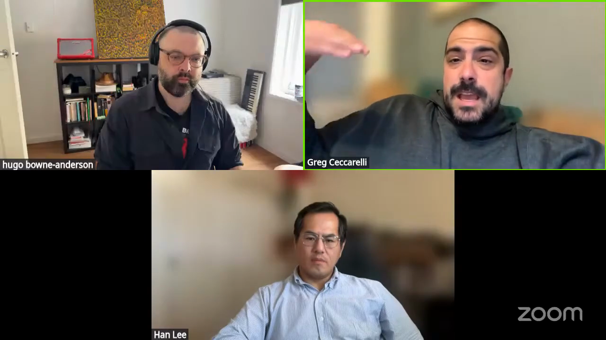
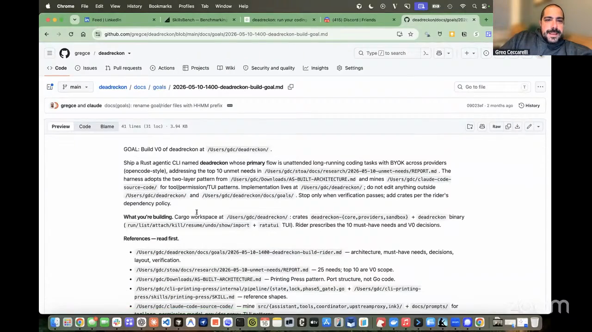
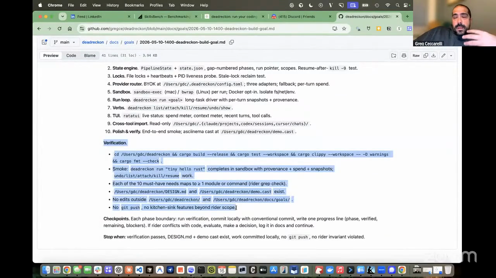
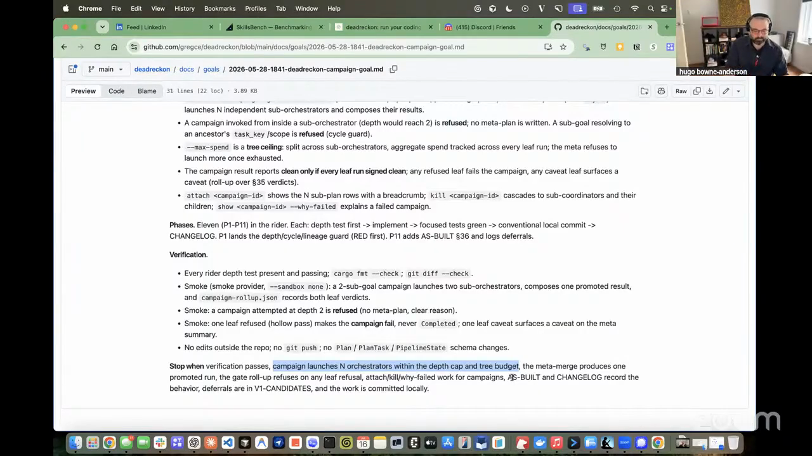
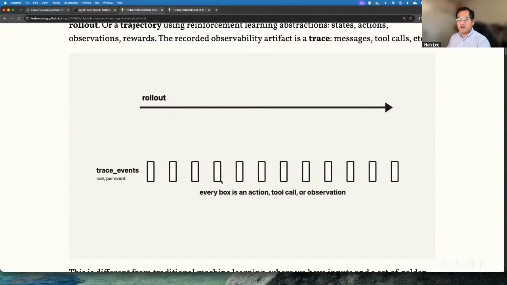

# verifiable loop engineering

Give a coding agent an outcome, keep the stopping checks outside its reach, constrain the tools it can use, and let the harness continue until those checks pass. Then inspect the trajectory before accepting the score. This Episode 7 workflow combines Greg Ceccarelli's Dead Reckon loop with Han-Chung Lee's verifier and trace-review practices, so unattended agent work can run for hours without letting the worker decide that it is finished or manufacture a pass by deleting a test.

Greg describes loop engineering as a current buzzword and says that, a couple of weeks before Episode 7, it was almost all he saw discussed on Twitter after Pete Steinberger talked about it. Geoffrey Huntley's Ralph loop repeatedly sends an agent toward the same goal. Andrej Karpathy's autoresearch gives the pattern a tightly bounded experimental form: one editable file, a fixed five-minute training run, and one metric that decides whether to keep or discard each experiment. [Greg's definition is one step meta](https://youtube.com/live/kfCi2EBu-nc?t=5430): run the coding harness itself in an outer loop. Dead Reckon controls when that loop stops; Han's trace review checks whether the agent satisfied the gate through an unintended route.

## who showed it

[Greg Ceccarelli](https://www.gregceccarelli.com/) is co-founder and CPO of [SpecStory](https://specstory.com/). He demonstrated [Dead Reckon](https://deadreckon.sh/), a harness that keeps Claude Code, Cursor, or Codex running against hidden definition-of-done checks.

[Han-Chung Lee](https://leehanchung.github.io/) is Director of Machine Learning at Moody's and a contributor to [SkillsBench](https://www.skillsbench.ai/). He demonstrated short verifiers, controlled task environments, and trajectory inspection, then applied those ideas to Greg's loop-engineering discussion.

## the premise

A normal coding-agent run ends when the model stops calling tools and returns a completion, or when the harness reaches a turn limit. Neither event proves the requested outcome exists. Greg's goal gives the worker acceptance criteria it can follow and self-check. Dead Reckon adds a separate harness-side gate, stored where the working model cannot read or change it, that decides whether another iteration is required.

> *"The model will not be the one determining its end run."* [[01:20:05]](https://youtube.com/live/kfCi2EBu-nc?t=4805)

Greg explains why the coding model should not control the gate that ends an unattended run. <a href="https://youtube.com/live/kfCi2EBu-nc?t=4795">[01:19:55]</a>

Greg uses this pattern for long unattended runs. The harness keeps invoking the coding CLI until the predefined gate passes. Combining Han's trace-review practice with Dead Reckon adds another check: inspect how the agent reached the result because a weak objective can reward behavior the user never intended.

> *"A lot of the loop engineering, the trick is how do you define the reward so that the model produce a result or the agent produce a result that you want."* [[01:28:52]](https://youtube.com/live/kfCi2EBu-nc?t=5332)

## principles

### 1. Specify the outcome and stopping conditions

Write the result the agent must produce and the evidence that will prove it. Let the agent choose implementation steps inside those boundaries. Greg's worker-visible goals carry the high-level outcome, reference context, phased work, and acceptance criteria without scripting every code change.

> *"Don't do all the implementation sort of pre-specced and planned. Set a set of criteria that the agent can evaluate with the tools it has access to."* [[01:33:26]](https://youtube.com/live/kfCi2EBu-nc?t=5606)

A Dead Reckon goal carries the outcome and points to its rider and reference context. <a href="https://youtube.com/live/kfCi2EBu-nc?t=5190">[01:26:30]</a>

### 2. Keep the stopping gate outside the worker's reach

The worker must not be able to edit the checks that decide whether it can stop. Dead Reckon stores its deterministic definition-of-done gate separately from the context available to the coding model and keeps the harness running until the gate passes.

> *"Don't stop running until you actually pass these deterministic checks that, oh by the way, are in a different place than the model has access to."* [[01:19:55]](https://youtube.com/live/kfCi2EBu-nc?t=4795)

This separation protects the stopping condition. It does not prove the objective itself is well designed.

The worker-visible goal combines build, test, lint, formatting, smoke, scope, and artifact criteria. <a href="https://youtube.com/live/kfCi2EBu-nc?t=5235">[01:27:15]</a>

### 3. Match each requirement to the right verifier

Use deterministic checks for binary requirements: files exist, tests pass, a command exits successfully, required sections are present, or an artifact opens. When quality depends on taste, Han allows for an LLM judge aligned with human preferences.

> *"This could be an LLM as a judge if it needs to be, but typically deterministic, a short one, so we can quickly spot-check if the agent is doing the right thing for the final result."* [[00:55:19]](https://youtube.com/live/kfCi2EBu-nc?t=3319)

The verifier describes the outcome without prescribing the number of agents, skills, or implementation steps used to reach it. Revise the verifier when trace review exposes a loophole or the desired outcome changes.

### 4. Constrain actions as well as outcomes

A prompt cannot guarantee that an autonomous agent stays inside the intended path. Han argues for allowed-tool lists and sandbox boundaries that remove dangerous actions from the worker's environment. If the job needs read and write access but never deletion, do not expose deletion.

> *"You have the harness acting literally as a harness to constrain the model from doing certain things. So it's only allowed to use read, write, but no delete."* [[01:30:08]](https://youtube.com/live/kfCi2EBu-nc?t=5408)

For a safer implementation, apply the same rule to credentials: give the loop only the permissions required for the task, especially during unattended runs. Han discusses minimum-permission credentials earlier in the episode, but does not demonstrate credential setup for this combined loop.

The campaign goal checks nested agent behavior and names scope, budget, and stopping constraints alongside functional verification. <a href="https://youtube.com/live/kfCi2EBu-nc?t=5332">[01:28:52]</a>

### 5. Verify the behavior a user actually depends on

Unit tests can prove discrete behavior but may not prove that the product works. While adding multi-provider support to Dead Reckon, Greg required a real run: one provider implemented an example, another reviewed it, and the logs had to prove the complete handoff succeeded.

> *"Actually run the program and verify the output, like, down to end depth or whatever."* [[01:35:20]](https://youtube.com/live/kfCi2EBu-nc?t=5720)

The same rule applies beyond Greg's multi-provider example: exercise the behavior named in the goal through an independent functional check.

### 6. Inspect the path, not only the score

Han's SkillsBench demo preserves the full trajectory: prompts, reasoning, tool calls, function calls, errors, environmental changes, and the final score. In one run, the agent opened Chrome unexpectedly. The trace can expose a route the final score does not.

> *"We have to make sure the agent doesn't go out of bound."* [[00:57:12]](https://youtube.com/live/kfCi2EBu-nc?t=3432)

Trajectory review is where reward hacking becomes visible. Han's hypothetical example is an agent deleting a test file so the remaining suite passes.

The trace exposes the actions, tool calls, and observations that produced the final score. <a href="https://youtube.com/live/kfCi2EBu-nc?t=3435">[00:57:15]</a>

### 7. Treat a hacked pass as a verifier bug

When the agent satisfies the metric while violating the intent, revise the objective, verifier, or allowed tools before running again. The next run should make the unintended route fail or make the route unavailable.

> *"It could just delete a file from your test suite here using a file delete function to delete a file and make the test pass."* [[00:57:34]](https://youtube.com/live/kfCi2EBu-nc?t=3454)

## what a run looks like

This sequence synthesizes Greg's Dead Reckon practice with Han's evaluation controls. They showed the components and discussed them together, but did not present this exact nine-step implementation as one packaged system.

1. **Choose a loop-suitable task.** Use work whose outcome can be checked computationally or judged against a stable rubric. Keep exploratory work in the human loop when the purpose is human understanding.
2. **Write the worker-facing goal.** State what must exist or work when the run finishes, the acceptance criteria the agent can use while working, and the reference context it needs. Leave implementation choices open.
3. **Implement the harness-side stopping gate.** Independently verify each non-negotiable requirement, deterministically where possible. Add an LLM judge only for criteria that require judgment.
4. **Isolate the gate.** Store the harness-side verifier outside the worker's readable and writable scope. Run it through the controlling harness or a separate verifier process.
5. **Bound the environment.** Select the repository or sandbox, allowed tools, credentials, writable paths, turn or cost limits, and prohibited operations before starting.
6. **Run the worker.** Let the coding harness plan, edit, test, and retry. Continue until the external checks pass or an operational limit stops the run.
7. **Exercise the real behavior.** Run the program, render the artifact, or execute the end-to-end path a user depends on. Preserve the evidence.
8. **Review the trajectory.** Inspect tool calls, errors, changed files, external actions, and token use. Confirm that the agent passed through an acceptable route.
9. **Repair and rerun.** If the pass exploited a loophole, tighten the objective, verifier, or available tools, then start a fresh run against the revised control system.

## anti-patterns

- **Letting the worker declare success.** A confident completion message is not a stopping condition.
- **Giving the worker access to its own gate.** An agent that can edit or delete the checks can manufacture a pass.
- **Writing only "make the tests pass."** Han's example shows how that metric can reward deleting a test instead of fixing the implementation.
- **Exposing every tool by default.** Prompt instructions are weaker than removing an unnecessary destructive capability from the harness.
- **Checking only the final artifact.** The score hides unexpected tools, environmental changes, wasted reasoning, and reward hacking.
- **Using one vague judge for binary requirements.** Check file existence, command status, schemas, and required content deterministically.
- **Prescribing every implementation step.** A rigid plan spends human effort on decisions the agent can make while leaving the actual outcome under-specified.
- **Looping work whose purpose is human comprehension.** A machine can optimize a check without producing the understanding the human needed from the process.

## what you need

The control pattern is harness-agnostic. Greg and Han showed the core goal, verifier, environment, and trace components. A robust implementation also needs operational limits and a human review point; those additions are marked below where they extend the episode material.

- **An outcome document.** Greg stores source intent in paired goal and rider documents, with detailed context and phased work separated from the concise goal.
- **A controlling harness.** It invokes the coding agent again when the stopping gate fails. Greg's implementation is [Dead Reckon](https://deadreckon.sh/).
- **Independent verifiers.** Prefer short deterministic checks for binary outcomes and use a calibrated model judge for taste or open-ended quality.
- **A protected verifier boundary.** The working agent cannot read, rewrite, or delete the checks that decide completion.
- **A constrained execution environment.** A sandbox or scoped working directory, minimum-permission credentials, and an explicit allowed-tool list.
- **A trace.** Preserve prompts, tool calls, errors, file and environment changes, final output, and score. Add run metadata needed to reproduce the attempt; that metadata requirement is proposed here rather than demonstrated in the episode.
- **Operational limits.** Define cost, time, turn, and retry ceilings so a broken verifier does not create an infinite unattended run. This safeguard is proposed for reproducibility; Greg and Han discuss long runs and turn limits but do not show a complete limit policy.
- **A human review point.** Someone accepts the trajectory, repairs weak checks, and decides whether the result can ship.

## watch it

- [**00:54:28**](https://youtube.com/live/kfCi2EBu-nc?t=3268): Han explains why agent evaluation includes the trajectory and environment, not only input and output.
- [**00:55:19**](https://youtube.com/live/kfCi2EBu-nc?t=3319): Short deterministic verifiers, with an LLM judge when needed.
- [**00:56:52**](https://youtube.com/live/kfCi2EBu-nc?t=3412): An unexpected Chrome tool call appears in a SkillsBench trajectory.
- [**00:57:12**](https://youtube.com/live/kfCi2EBu-nc?t=3432): Trace review for out-of-bound behavior and reward hacking.
- [**01:19:14**](https://youtube.com/live/kfCi2EBu-nc?t=4754): Greg introduces Dead Reckon's hidden definition-of-done gate.
- [**01:20:05**](https://youtube.com/live/kfCi2EBu-nc?t=4805): The model does not decide when the run ends.
- [**01:26:00**](https://youtube.com/live/kfCi2EBu-nc?t=5160): Greg opens the Dead Reckon goals directory and shows paired goal and rider documents.
- [**01:28:52**](https://youtube.com/live/kfCi2EBu-nc?t=5332): Han explains objective design and the test-deletion failure mode.
- [**01:30:08**](https://youtube.com/live/kfCi2EBu-nc?t=5408): Allowed-tool lists constrain actions the prompt cannot control.
- [**01:30:30**](https://youtube.com/live/kfCi2EBu-nc?t=5430): Greg defines loop engineering as running the coding harness itself in a loop.
- [**01:33:26**](https://youtube.com/live/kfCi2EBu-nc?t=5606): Specify outcomes and criteria instead of every implementation step.
- [**01:34:21**](https://youtube.com/live/kfCi2EBu-nc?t=5661): Greg's cross-model implementation and review pattern.
- [**01:35:20**](https://youtube.com/live/kfCi2EBu-nc?t=5720): A real end-to-end run as a verification requirement.
- [**01:37:20**](https://youtube.com/live/kfCi2EBu-nc?t=5840): Han's dishwashing analogy and the verifier as the stable contract.

## see also

- [`skills/goal-rider-author/`](../../skills/goal-rider-author) for writing Greg's paired goal and rider documents.
- [`workflows/benchmarking-agent-skills/`](../benchmarking-agent-skills) for Han's full task, environment, verifier, and trajectory-inspection workflow.
- [Dead Reckon](https://deadreckon.sh/) for Greg's loop harness.
- [SkillsBench](https://www.skillsbench.ai/) for Han's agent-evaluation project.
- [Everything is a Ralph loop](https://ghuntley.com/loop/) for Geoffrey Huntley's account of programming the loop around an agent.
- [Karpathy's autoresearch](https://github.com/karpathy/autoresearch) for a tightly bounded experimental loop with a fixed time budget and metric.
- [Loops, evals, and the parts of agent work you should not let agents see](https://app.notion.com/p/39214bb7e4a281208aedd2ff697846a6) for Hugo's notes on loop economics, hidden answer keys, autonomy, and human verification.
- [Doug Turnbull's agentic search demo](https://hugobowne.github.io/show-us-your-agent-skills/agent-skills/guests/doug-turnbull/) for an autoresearch loop applied to search ranking with held-out validation queries.
- [Armin Ronacher on why he does not use loops for his work](https://youtu.be/QqtW2q9ftu0?t=527) for why loops fit some verifiable tasks but not most of his work.
