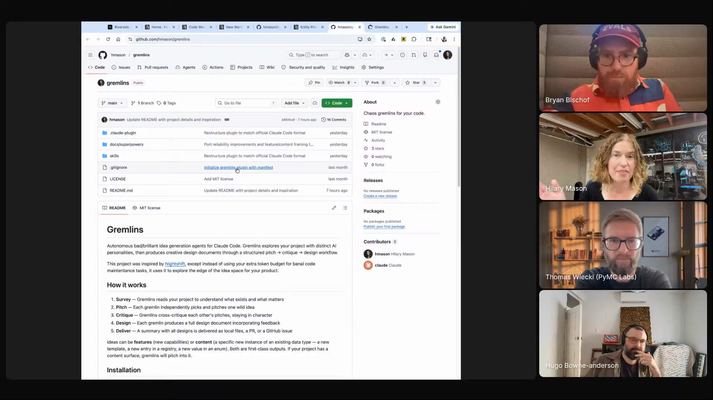

# weekly-gremlins

A scheduled multi-agent loop pointed at the long tail of the idea distribution. Three agent personas, each with a different optimization target, pull from a bad-ideas backlog every weekend, pitch and critique each other, and produce design docs for moonshots that would never make it onto a roadmap. Captured from Hilary Mason's episode 2 segment, where the canonical version runs against Hidden Door's "Bad Ideas" Slack channel every Sunday night and surfaces a Monday-morning review queue.

She extracted a [generalized version](https://github.com/hmason/gremlins) that runs against any codebase.

## who showed it

Hilary Mason is CEO and co-founder of Hidden Door, an AI-powered game and interactive storytelling platform where players collaborate with AI characters in world-building and live roleplay. Previously founded Fast Forward Labs (acquired by Cloudera) and served as chief scientist at Bitly.

## the premise

Spare-token agent infrastructure usually gets pointed at maintenance. Hilary points it the other way.

> *"I love them. So I was inspired by Nightshift, which I don't know if you know it, but it's a library that checks if you have any extra tokens in your subscription budget at the end of the week, and then it does all the things you're supposed to do as a really good software engineer."* [\[01:14:13\]](https://youtube.com/live/l37PR-OkYKA?t=4453)

What she actually wanted was different:

> *"it's the end of the week, I have some tokens. But what I want is to work on the weird stuff, like all the bad ideas, all the stuff that nobody has the time for because... it's way too out there on the distribution of things that could be productive."* [\[01:14:51\]](https://youtube.com/live/l37PR-OkYKA?t=4491)

The gremlins are her answer: take the budget that would have gone to autoformatting and stale-test cleanup and route it into the ideas no human would put on a roadmap.

Hilary on stream showing the generalized gremlins repo she extracted from Hidden Door's internal setup, at the moment she offered it to the audience. <a href="https://youtube.com/live/l37PR-OkYKA?t=4610">[01:16:50]</a>

## principles

### 1. Spare cycles go to bad ideas, not chores

[Nightshift](https://github.com/marcus/nightshift)'s framing (use extra tokens for the things "you're supposed to do as a really good software engineer") is a fit for some teams. For Hilary it is the wrong fit. The interesting ideas are the ones nobody has time to pitch because they sound silly: typos that become Python packages, sound effects for data structures, weird tangents between two meetings. The cron budget is fungible; how you point it is a choice.

### 2. Multiple personas, different optimization targets

> *"There is a perfectionist, which is make our code base and our product amazing, but perfect. And then there's the sort of player, the user perspective of what would a player want? I sort of pull off this bad ideas list. They make their own spin on it based on the other goals they've been given, and then they propose, they pitch to each other, they critique each other, and then they write a design doc."* [\[01:16:09\]](https://youtube.com/live/l37PR-OkYKA?t=4569)

Hidden Door runs three personas: Hilary herself, a perfectionist focused on the codebase and product, and a player taking the user's perspective. Each starts from the same bad-ideas backlog and filters it through its own lens; the variance between their takes is what makes the output worth reading on Monday morning. The [public version](https://github.com/hmason/gremlins) ships with three default personalities (Chaos Agent, Perfectionist, End User) that you can customize or replace.

### 3. Critique before commit

The gremlins do not write a design doc each. They write design docs together, after pitching and critiquing each other. The single-agent path to a "good" idea collapses to the homogenizing default Hilary names elsewhere in her segment:

> *"they're aspirationally very mid."* [\[00:47:14\]](https://youtube.com/live/l37PR-OkYKA?t=2834)

Cross-persona critique before anything gets written is the local fix.

### 4. Schedule it so it actually happens

The gremlins run on a cron, every Sunday night, with the team reviewing results Monday morning. The cadence matters. Without it, "use spare cycles on bad ideas" stays an aspiration. The scheduled run forces it to ship, the Monday review forces it to be looked at.

### 5. A human picks what advances

The gremlins write design docs. They do not commit code, they do not file PRs, they do not act on their own proposals. Monday's review is where ideas either die or get pulled into actual planning. The loop is about generating interesting candidates, not autonomous execution.

## what a session looks like

1. **Maintain a bad-ideas backlog.** Hidden Door uses a Slack channel called Bad Ideas where staff drop shower thoughts, speculative features, and the obviously-not-shipping. The backlog is the raw fodder.
2. **Define your personas.** Pick a small number (Hilary runs three) with explicitly different optimization targets. The point is variance, not coverage.
3. **Schedule a recurring run.** Hilary runs Sunday night, against the bad-ideas backlog and the relevant codebase. Cron, GitHub Action, launchd, any scheduler.
4. **Run the gremlins.** Each persona surveys the project, pitches one wild idea in character, critiques the others' pitches, and produces a full design doc incorporating the critique it received. The critique step is load-bearing.
5. **Output a design doc, not a patch.** The bundle is a set of written proposals a human can read in a few minutes and decide whether to pursue. No code, no autonomous action.
6. **Review Monday morning.** The team reads what the gremlins surfaced and picks which (if any) to actually do. Most are bad. A few are not.

The kind of thing the loop is built to surface, in Hilary's own phrasing:

> *"that is the kind of bullshit you can get up to when you've got 30 minutes between two meetings and a bad idea."* [\[01:13:19\]](https://youtube.com/live/l37PR-OkYKA?t=4399)

Her worked example was [`beepcopy`](https://github.com/hmason/beepcopy), a Python library that deep-copies a data structure and writes out a music file representing it. Sounds ridiculous; surfaced a real bug in Hidden Door's game state because she heard a refrain in the audio that should not have been there. That bug-find is the proof of concept the gremlins are an industrialized version of.

## anti-patterns

- **Pointing the cron at chore-style work.** Lint cleanup, dependency bumps, stale-test triage. Useful, but it is what Nightshift already covers; if you do this, you have not built gremlins.
- **One persona writing the design doc alone.** The variance comes from the critique step. A single perfectionist agent will converge on the same neat-and-tidy ideas every time.
- **Treating the design docs as a backlog to ship.** Most of these ideas are bad, by construction. The point is to widen the search, not to grow your queue of committed work.
- **Skipping the Monday review.** If no human reads them, the gremlins are generating slop into a folder. The review is what closes the loop.
- **Running the gremlins on your "good" backlog.** You already have good ideas. Pointing the gremlins at them collapses the workflow into "agents do roadmap work badly." Keep the inputs weird.

## what you need

- **A bad-ideas backlog.** Some place where people drop ideas that are too small, too weird, or too out-there for a roadmap meeting. Hidden Door uses a dedicated Bad Ideas Slack channel; any append-only ideas pile works.
- **A small number of agent personas with distinct goals.** Hilary runs three. Each needs its own instructions and its own optimization target, so the critique step is not a rubber stamp. Ideas can pitch into feature space (new capabilities) or content space (a new template, a new entry in a registry, a new value in an enum); both are first-class outputs.
- **A scheduler.** Cron, GitHub Actions, a launchd job, whatever your team will actually keep running. Hilary runs hers on Sunday nights.
- **An output target a human will read.** Design docs in a directory, an inbox channel, a queue in your project tool. Generation is cheap; the bottleneck is whether anyone looks.
- **The generalized version.** [`hmason/gremlins`](https://github.com/hmason/gremlins) is the version Hilary extracted from the Hidden Door setup so it can run against any codebase. Packaged as a Claude Code plugin with built-in slash commands for setup, running, and scheduling; three default personalities (Chaos Agent, Perfectionist, End User) that you can edit or replace. See the repo for install and configuration.

> *"I also extracted a hopefully working version that anyone can run against their code base. So maybe we can share that. And I would love, love, love if people give it a try, and hopefully it gets more of our bad ideas out there into the world."* [\[01:16:44\]](https://youtube.com/live/l37PR-OkYKA?t=4604)

## watch it

- [**00:47:14**](https://youtube.com/live/l37PR-OkYKA?t=2834): "Aspirationally very mid." Why the default LLM output needs context and counter-pressure.
- [**01:12:24**](https://youtube.com/live/l37PR-OkYKA?t=4344): beepcopy. The bad idea that surfaced a real bug.
- [**01:13:19**](https://youtube.com/live/l37PR-OkYKA?t=4399): "Bullshit you can get up to between two meetings." The R&D philosophy that motivates gremlins.
- [**01:14:13**](https://youtube.com/live/l37PR-OkYKA?t=4453): Nightshift as inspiration, and the reframe to bad ideas.
- [**01:16:09**](https://youtube.com/live/l37PR-OkYKA?t=4569): The three personas. Perfectionist, player, and the critique loop.
- [**01:16:44**](https://youtube.com/live/l37PR-OkYKA?t=4604): The generalized version, offered to anyone who wants to try it.

## see also

- [`hmason/gremlins`](https://github.com/hmason/gremlins) for Hilary's generalized version of the Hidden Door setup.
- [`hmason/beepcopy`](https://github.com/hmason/beepcopy) for the worked example of a bad idea that surfaced a real bug.
- [`skills/prompt-refinement/`](../../skills/prompt-refinement) for the other shareable Hilary brought to the show.
